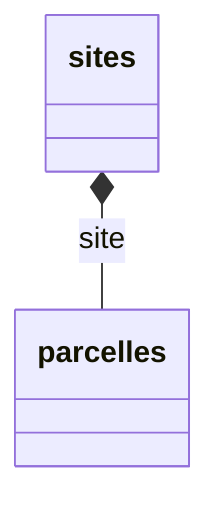

# Aide fichier Yaml

## La création :

Vous trouverez ci dessous un exemple de fichier Yaml fictif qui décrit les partie attendues dans celui ci pour qu'il 
soit valide. **Attention le format Yaml est sensible** il faut donc respecter l'indentation. 

Il y a 5 parties (<span style="color: orange">sans indentation</span>) attendues dans le fichier : 

  * version, 
  * application, 
  * references,
  * compositeReferences, 
  * dataTypes

<span style="color: orange">l'indentation du fichier yaml est très importante.</span>

### on commence par mettre la version du parser de yaml. 
Soit version actuelle du site qui est 0 actuellement.

``` yaml
version: 0
```

<span style="color: orange">*version* n'est pas indenté.</span>

### on présente l'application avec son nom et sa la version du fichier yaml : 
(on commence par la version 1) 

S'il y a déjà une application du même nom mais que l'on a fait des modifications dans le fichier on change de version.
``` yaml
application:
  name: Aplication_Nom
  version: 1
```

<span style="color: orange">*application* n'est pas indenté. *nom* et *version* sont indentés de 1.</span>

### on décrit les donnés de référence dans la partie *references*, on y liste les noms des colonnes souhaitées (dans *columns*); on précisant la liste de colonnes qui forment la clef naturelle (dans *keyColumn*): 
par exemple pour les fichiers :


- sites

| nom du site |
| ------ |
| site1 |
| site2 |

- parcelles

| site | nom de la parcelle |
| ------ | ------ |
| site1 | 1 |
| site2 | 1 |

on aura le yaml suivant

``` yaml
references:
  agroécosystème: 
    keyColumns: [nom]
    columns:
      nom:
    nom
  sites:
  #donnée de référence avec une clef sur une colonne
    keyColumns: [nom du site]
    columns:
      Agroécosystème:
      nom du site:
  parcelles:
  #donnée de référence avec une clef sur deux colonnes
    keyColumns: [site,nom de la parcelle]
    columns:
      site:
      nom de la parcelle:
```

Le nom des colonnes des references doivent être courte pour ne pas être tronqué lors de la création de l'application.
Penser à mettre le même nom de colonnes dans le fichier *.csv* que dans la partie *columns* du fichier yaml.

<span style="color: orange">*references* n'est pas indenté. *sites* et *parcelles* sont indentés de 1. *keyColumns* et 
*columns* sont indentés de 2. Le contenue de *columns* seront indenté de 3.</span>

### il est possible de définir des clefs composite entre différentes références


  Une clef composite permet de définir une hiérarchie entre différentes données de référence.
  Dans l'example ci-dessous il y a une relation oneToMany entre les deux données de référence nomDeLaReferences et 
  nomDeLaReferences2. 

  La clef naturelle permet de distinguer deux lignes distinctes
  La clef composite rajoute une hiérarchie entre les données de référence. Dans l'exemple ci-dessous pour référencer 
  une ligne nomDeLaReferences2, il faudra utiliser comme valeur la clef technique crée : site1.site1__1

  La clef crée sera en minuscule, ne comportera pas d'accents; les espaces sont remplacés par des underscores; les 
  traits d'union sont supprimés.
  "Ma clé qui-sert-de-référence" -> "ma_cle_quisertdereference"
  Elle ne doit alors comporter que des lettres minuscules de chiffres et des underscores tous les autres caractères 
  seront supprimés.




``` yaml
compositeReferences:
  localizations:
    components:
      - reference: sites
      - reference: parcelles
        parentKeyColumn: "site"
```

<span style="color: orange">*compositeReferences* n'est pas indenté. *localizations* est indenté de 1. *components* est 
indenté de 2. *- reference* et *- parentKeyColumn* sont indentés de 3. Le *reference* qui est sous parentKeyColumn est 
indenté de 4.</span>

### on met les infos des *dataTypes* 
 Pour enregistrer un type de données, il faut déclarer 
 - le data : ce qui sera enregistré en base de données (*section data*)
 - le format du fichier (*section format*)
 - les authorisations (*section authorisations*)
 - les validations de chaque ligne
#### Nous regrouperons les données par nom du fichier csv qu'on souhaite importer (*nomDonnéeCSV*).</h4>

``` yaml
dataTypes:
  nomDonnéeCSV:
```

<span style="color : orange">*dataTypes* n'est pas indenté. *nomDonnée* est indenté de 1.</span>

##### *data* 
La section data permet de décrire le schéma des données enregistrées en base. Les données sont enregistrées comme une 
liste de *variables* pouvant avoir plusieurs *components*.
Les *variables/components* peuvent être des constantes ou des valeurs calculées, provenir d'un en-tête, ou provenir des 
colonnes.

*date*, *localization* et *prélèvement* sont des exemples de nom de variable qui regrouperont plusieurs components.
 On fait la liste de *components* pour chaque variable. 

Par exemple *day* et *time* sont les *components* de la variable *date*. 

On vérifie leurs formats grace aux *checker* -> *name* est le nom du checker et *params* permet de définir les 
paramètres du format via le *pattern*.
Voici quelque possibilité de *pattern* possible pour les dates et heures : 

|pattern   | exemple 1    | exemple 2   |
| -------- |   ---------  | ---------   |
|dd/MM/yy  |31/01/21      | 31/12/21    |
|dd/MM/yyyy|31/01/2021    |31/12/2021   |
|MM/yyyy   |01/2021       |12/2021      |
|M/yyyy    |1/2021        |12/2021      |
|HH:mm     |13:00         |01:00        |
|hh:mm:ss  |13:00:00      |01:00:00     |
|dd/MM/yy hh:mm:ss|31/01/21 13:00:00|31/12/21 01:00:00|

<span style="color : orange">Pour les dates anglaises inverser le "dd" avec le "MM" (exemple : MM/dd/yy -> 01/31/21) et 
pour l'heure anglaise il suffit d'ajouter am/pm (exemple "hh:mm am/pm"-> "01:00 am" ou "hh:mm:ss AM/PM" -> "01:00:00 AM"). 
Le *pattern* doit correspondre avec le format de la date dans le fichier CSV.</span>

pour les données :

| date | heure | nom de la parcelle | point | volume | qualité |
| ------ | ------ | ------ | ------ | ------ | ------ |
| 12/01/2010 | 10:00:00 | site1.site1__1 | 2 | 240.7 | 2 |
| 12/01/2010 | 15:30:00 | site2.site2__1 | 1 | 105.25 | 1 |

On décrit un format pour stocker les données sous la forment

``` json
  {
    date:{
      datetime: "12/01/2010 10:00:00",
      day: "12/01/2010",
      time: "10:00:00"
    },
    localization:{
      parcelle:"site1.site1__1",
      point:"2"
    },
    prélèvement:{
      volume:240.7,
      qualité:2
    }
  }
```

``` yaml
    data:
      date:
        components:
          datetime:
            #calcul d'une valeur par défaut date+time avec une expression groovy
            defaultValue: >
              return datumByVariableAndComponent.get("date").get("day") +" " +datumByVariableAndComponent.get("date").get("time")+ ":00"
          day:
            checker:
              name: Date
              params:
                pattern: dd/MM/yyyy
          time:
            checker:
              name: Date
              params:
                pattern: hh:mm:ss
      localization:
        components:
          parcelle:
            checker:
              name: Reference
              params:
                refType: parcelles
          point:
            checker:
              name: Integer
      prélèvement:
        components:
          volume:
            checker:
              name: Float
          qualité:
            checker:
              name: Integer
```

<span style="color: red">*/!\ *refType* doit forcément être identique aux noms des références déclarées dans la partie 
*references* /!\ </span>

<span style="color: orange">*data* est indenté de 2. Les variables sont indentés de 3 et les components le sont de 4.</span>

##### la validation est utilisé pour valider une ligne.

Les *variables/components* sont passés dans la map *datum*. On récupère la valeur du component qualité de la variable SWC

``` yaml
    validations:
      swcQualityEnumeration:
        description: "Si renseignée, la qualité du taux d'humidité vaut 1, 2 ou 3"
        checker:
          name: GroovyExpression
          params:
            expression: >
              Set.of("", "0", "1", "2").contains(datum.get("SWC").get("qualité"))
```
Cette formulation vérifie que la valeur du component qualité de la variable SWC est vide ou égale à 0,1 ou 2
L'expression doit renvoyer true

La partie validation peut être utilisée pour vérifier le contenu d'une colonne d'un fichier de référence

<span style="color: orange">*validations* est indenté de 2. </span>

##### *authorization* porte bien son nom c'est là qu'on définira les autorisations d'accès aux données :
Authorization permet de définir des groupes de valeurs. Une ligne du fichier est découpée en autant de ligne que de 
*dataGroups* et contient un *authorizationScope* et un *timeScope*.
Les droits sont portés par la ligne. (un dataGroup + un authorizationScope + un timeScope)

Dans *dataGroups* nous regrouperont les données par type de données.

-> *authorizationScope* clef naturelle d' une ligne de fichier en combinaison avec.

-> *timeScope* est la partie qui permet de mettre une autorisation sur une durée.

``` yaml
    authorization:
      dataGroups:
        typeDonnée1:
          label: "Référentiel"
          data:
            - date
            - localization
        typeDonnée2:
          label: "Données qualitatives"
          data:
            - prélèvement
      authorizationScopes:
        localization_ref1:
          variable: localization
          component: parcelle
        localization_ref2:
          variable: localization
          component: point
      timeScope:
        variable: date
        component: datetime
```

<span style="color: orange">*authorization* est indenté de 2. *dataGroups*, *authorizationScopes* et *timeScope* sont 
indenté de 3.</span>

##### ensuite on va décrire le format des données attendues (dans *format*) décrite dans la partie *dataTypes* : 

Si votre fichier à des données mise dans un cartouche vous devrez les décrire dans la partie *constants*.
On précisera le nombre de lignes dans la cartouche dans *rowNumber* et le nombre de colonnes utiliser dans la cartouche 
dans *columnNumber*.

ici le contenu de la première ligne deuxième colonne est lié au varaible/component localization/nomDonnée et apparaîtra 
à l'export dans une colonne "type de données"
``` yaml
    format:
      constants:
        - rowNumber: 1
          columnNumber: 2
          boundTo:
            variable: localization
            component: nomDonnée
          exportHeader: "type de données"
```

<span style="color: orange">*format* est indenté de 2. </span>

*headerLine* permet de mettre le nombre de la lignes qui contient le nom des colonnes décrite plus bas dans *columns*.

``` yaml
      headerLine: 1
```

*firstRowLine* sera égale au numéro de la première ligne dans la quelle se trouvera les premières données.
``` yaml
      firstRowLine: 2
```

*columns* est la partie dans laquelle nous décrirons toutes les colonnes et leurs types de données que nous attendons 
dans chaque colonne du fichier CSV (pour l'exemple utilisé ici c'est pour les données du fichier nomDonnées.csv):

*header* doit avoir exactement le même nom que le nom de la colonne dans le fichier csv.

``` yaml
      columns:
        - header: "nom de la parcelle"
          boundTo:
            variable: localization
            component: parcelle
        - header: "point"
          boundTo:
            variable: localization
            component: point
        - header: "date"
          boundTo:
            variable: date
            component: day
        - header: "heure"
          boundTo:
            variable: date
            component: time
        - header: "volume"
          boundTo:
            variable: prélèvement
            component: volume
        - header: "qualité"
          boundTo:
            variable: prélèvement
            component: qualité
```

## lors de l'importation du fichier yaml :
	
* mettre le nom de l'application en minuscule,
* sans espace,
* sans accent,
* sans chiffre et 
* sans caractères speciaux

# Aide fichier .csv  
	
## lors de la création du fichier csv : 
	
* cocher lors de l'enregistrement du fichier 
  * Éditer les paramètre du filtre
  * Sélectionner le point virgule
* dans les données qui se trouve dans les colonnes contenant des clés naturels ne pas mettre
    * pas d'accents
    * pas de majuscules
    * pas de caratères spéciaux () , - : 
    * autorisé _ et .
* le nom des colonnes doivent être le plus court possible

## lors de l'ouverture du fichier csv via libre office:  
	
* sélectionner le séparateur en ";"
