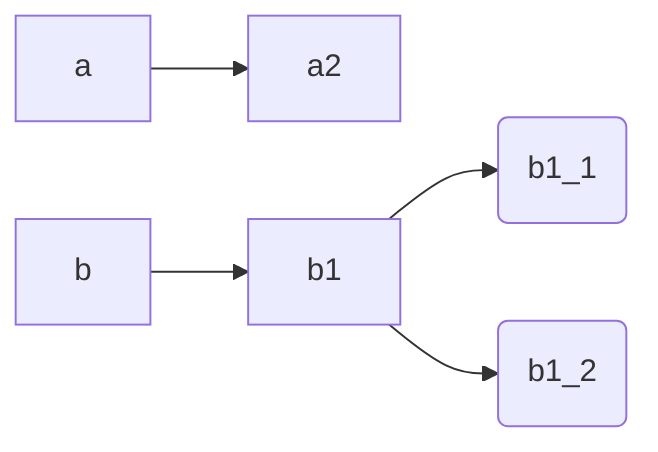
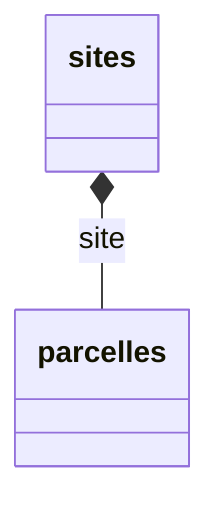
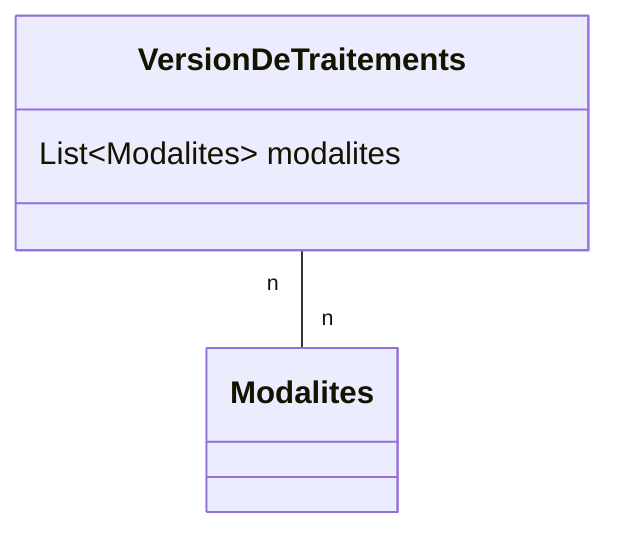

# Introduction

Ce document permet d'aider un gestionnaire de SI à décrire son domaine dans un fichier de configuration qui, une fois déposé dans l'application, génèrera une base de données et les outils permettant de l'alimenter et de la consulter.

Chaque fichier de configuration déposé génèrera une schéma dédié dans la base de données.

## Préalable
Avant de débuter l'écriture du fichier de configuration, il faut travailler à définir le modèle des données que vous voulez traiter dans la base de données.

Vous avez en votre possession un certain nombre de fichiers (format csv) contenant les données. Un fichier de données respecte un certain format. En particulier les en-têtes de colonnes doivent être fixés, et le contenu sous un en-tête a un format déterminé (date, valeur flottante, entier, texte..).

Chaque format de fichier correspond à ce que l'on appelera un type de données. Il regroupe plusieurs variables correspondant à une thématique, un pas de temps, une structuration des données... communs.

Chaque ligne peut être identifiée par sous-ensemble de colonnes ce qui permet de mettre à jour une données.

Chaque ligne porte sur une ou plusieurs colonnes une information de temporalité.

Chaque ligne porte aussi sur une ou plusieurs colonnes des informations sur le contexte d'acquisition des variables des autres colonnes.

On peut vouloir aussi faire figurer dans la base de données certaines informations non présentes dans le fichier de données.

- des informations liées aux variables que l'on fournit sous la forme de fichier de réferentiels (description de site, description de méthodes, description d'unités, description d'outils...)
- des informations constantes ne dépendant pas du fichier (par exemple l'unité de la variable)
- des informations constantes pour l'ensemble du fichier (par exemple le site correspondant aux valeurs du fichier). C'est informations pouvant être décrite dans un cartouche, avant l'en-tête de colonne ou juste sous l'en-tête de colonne (valeur minimum ou maximum)
- des informations calculées à partir d'informations du fichier, d'informations des référentiels déjà déposés ou même des données déjà publiées.

### exemple
supposons que l'on ait un fichier de données météorologiques


```csv
Région;Val de Loire;;;
Période;06/2004;;;
Date de mesure:Site;Précipitation;Température moyenne;Température minimale;Température maximale
01/06/2004;Os1;30;20;10;24
07/06/2004;Os1;2;22;14;27
07/06/2004;Os2;0;21;9;28
```
- La temporalité est portée par la colonne "Date de mesure"
- Le contexte est portée par l'information du cartouche d'en-tête "Région" et la colonne "Site".
- On identifie 4 variables:
  - date au format dd/MM/yyyy (format au sens SQL : https://www.postgresql.org/docs/current/functions-formatting.html#FUNCTIONS-FORMATTING-DATETIME-TABLE). Cette variable n'a qu'une seule composante "day". On note que les moyenne sont calculées à la journée.
  - localization qui fait référence à un site de la colonne "Site", avec deux composantes (site et region)
  - precipitation qui correspond à la pluviométrie de la colonne "Précipitation" avec deux composantes (value,unit=mm)
  - temperature qui se référe aux colonnes "Température moyenne", "Température minimale" et "Température maximale" avec 4 composantes (value,min,max,unit=°C)

Du coup on peut aussi définir des référentiels pour préciser ses informations

__region.csv__
```csv
code ISO 3166-2;nom
FR-ARA	Auvergne-Rhône-Alpes
FR-BFC	Bourgogne-Franche-Comté
FR-BRE	Bretagne
FR-CVL	Centre-Val de Loire
FR-COR	Corse
FR-GES	Grand Est
FR-HDF	Hauts-de-France
FR-IDF	Île-de-France
FR-NOR	Normandie
FR-NAQ	Nouvelle-Aquitaine
FR-OCC	Occitanie
FR-PDL	Pays de la Loire
FR-PAC	Provence-Alpes-Côte d'Azur
```

__site.csv__
```csv
nom:Date de création;region
Os1;01/01/2000;FR-CVL
Os2;01/01/2000;FR-CVL
```
Les sites font référence aux régions.

__unite.csv__
```csv
nom;nom_fr;nom_en;code
temperature;Température;Temperature;°C
precipitation;Précipitation;Precipitation;mm
```
Le fait de dire que l'unité d'une donnée fait référence au référentiel unite signifie:
- que l'unité doit être présente dans ce référentiel,
- que l'on ne pourra pas supprimer une unité du référentiel si on y a fait référence.

On aurait pu rajouter des responsables de site et de région, des descriptions des variables, des intervales de valeurs...

Ainsi nous avons pu faire une analyse de notre domaine et le format des fichiers qui s'y rapportent. Nous pouvons commencer l'écriture du fichier de configuration.

### Vocabulaire
#### Référentiels
__references__: Un ensemble d'informations permettant de préciser le contexte de la mesure ou de l'observation. En déportant ces informations dans des fichiers __references__, on évite la répétition d'informations. On utilisera la clef d'une information pour y faire référence.

#### Types de données
__data__ : Un ensemble de données correspondant à une thématique et un format de fichier commun. 

__variable__ : correspond à un ensemble de données, qualifiant ou se rapportant à une variable de mesure, d'observation, d'informations, de temporalité ou de contexte. 

__component__ : un ensemble de valeur qui servent à décrire une variable (valeur, écart type, nombre de mesure; indice de qualité; méthode d'obtention...)

__localisationScope__ :  Une ou des informations contextuelles (variable-component) qui font sens pour limiter les autorisations.

__timeScope__ :  L'information de temporalité d'une ligne faisant sens pour limiter des authorisations à une période.

__dataGroups__ : un découpage partitionement de variables en un ensemble de groupes de variables (__dataGroups__), pour limiter les droits à la totalité ou a des sous ensembles de variables.

On pourrait dans notre exemple distinguer 3 __dataGroups__:
- informations(date et localization)
- precipitation(precipitation)
- temperature (temperature)
Mais on peut aussi faire le choix d'un seul groupe
- all(date,localization,precipitation,temperature)
Ou de 4 groupes en découpant informations en date et localization

# Aide fichier à la rédaction du fichier de configuration
## La création :
Vous trouverez ci-dessous un exemple de fichier Yaml fictif qui décrit les parties attendues dans celui-ci pour qu'il 
soit valide. **Attention le format Yaml est sensible** il faut donc respecter l'indentation. 

Il y a 5 parties (<span style="color: orange">sans indentation</span>) attendues dans le fichier : 

  * version, 
  * application, 
  * references,
  * compositeReferences, 
  * dataTypes

<span style="color: orange">l'indentation du fichier yaml est très importante.</span>


### Description du fichier

Informations sur le fichier lui même

#### on renseigne la version de l'analyseur (parser) du fichier de configuration.
Soit version actuelle du site qui est 1 actuellement. Il faut avoir en tête que lorsque l'application évolue et que la version de l'analyseur s'incrémente, le fichier de configuration peut ne plus être valide.


``` yaml
version: 1
```

<span style="color: orange">*version* n'est pas indenté.</span>
#### on présente l'application avec son nom et la version du fichier de configuration :
(on commence par la version 1) 

S'il y a déjà une application du même nom mais que l'on a fait des modifications dans le fichier on incrémente la  version.

``` yaml
application:
  name: application_nom
  internationalizationName:
    fr: Ma première application
    en: My first application
  version: 1
```

> :warning: Les sections d'internationalisation ne sont pas obligatoires, mais permettent une internatinalisation des interfaces.


<span style="color: orange">*application* n'est pas indenté. *nom* et *version* sont indentés de 1.</span>

## A propos du format yaml

on utilise le format clef: valeur. 
- la clef est le nom d'une valeur ou d'une sous section
- la valeur peut être une chaine, une chaine sur plusieurs lignes, une valeur numérique, un booléen, un ensemble de valeurs (liste),
un ensemble de __clef-valeur__ (sous-section ou objet)
```yaml
nom: Toto # un commentaire avec #
age: 22 #22 est la valeur de age
marié: true
enfants: [Thomas,Celine,Jean]# une liste
petits-enfants:
  maternel: # une sous section
    - Jeanne: 
  paternel:
    - Roger # une liste sur plusieurs lignes
    - Thiefaine
"texte préféré": > #pour commencer un texte mutiligne
  Voici un texte sur plusieurs ligne
  avec saut de ligne
  
  et tout le tintouin
  La fin du texte est signifié par la fin du retrait
"autre": "Voici un texte entre guillemets"
#et voici une liste d'objets
vehicule:
  - marque : golf
    annee: 2012
    couleur: rouge
  - marque : citroën 
    annee: 2004
    couleur: bleue
```
- on peut rajouter des commentaires avec #
- On met : après une clef suivi d'un espace avant la valeur
- Une liste peut être entre crochet __[]__ avec __,__ comme séparateur, ou à la ligne avec un retrait et un __-__
- l'absence de valeur peut être traduite de plusieurs façon
```yaml
rien:
encore rien: ~
toujours rien: null
```

### Chaque retrait est une sous section

```yaml
a:
 a1: "a1"
 a2:
b:
 b1:
   b1-1: false
   b1-2:


```
donne la hiérarchie de sections:


> :warning: Une valeur peut être une valeur (chaine de texte, valeur numérique ou booléean) ou bien une section


### Description référentiels
on décrit les référentiels dans la partie *references*, on y liste les noms des colonnes souhaitées (dans *columns*); on précisant la liste de colonnes qui forment la clef naturelle (dans *keyColumn*):


pour le modèle de référentiels



et pour les fichiers :


- __sites.csv__

| nom du site |
| ------ |
| site1 |
| site2 |

- __parcelles.csv__

| site | nom de la parcelle |
| ------ | ------ |
| site1 | 1 |
| site2 | 1 |

on aura le yaml suivant

``` yaml
references:
  agroécosystème: 
    keyColumns: [nom]
    columns:
      nom:
    nom
  sites:
  #donnée de référence avec une clef sur une colonne
    keyColumns: [nom du site]
    columns:
      Agroécosystème:
      nom du site:
  parcelles:
  #donnée de référence avec une clef sur deux colonnes
    keyColumns: [site,nom de la parcelle]
    columns:
      site:
      nom de la parcelle:
```

Le nom du référentiel est libre. Cependant pour ceux réutilisés  ailleurs dans l'application, préférer utiliser minuscules et underscores sous peine de générer des erreurs: 

```
exemple: mon_nom_de_referentiel
```

> :warning: Le nom des colonnes des references doivent être courtes pour ne pas être tronqué lors de la création des vues de l'application. 
 Les noms des colonnes dans la base de données est limité à 63 caractères. Dans les vues, ce nom est une concaténation du nom du référentiel et du nom de la colonne


Penser à mettre le même nom de colonnes dans le fichier *.csv* que dans la partie *columns* du fichier yaml.

<span style="color: orange">*references* n'est pas indenté. *sites* et *parcelles* sont indentés de 1. *keyColumns* et 
*columns* sont indentés de 2. Le contenue de *columns* seront indenté de 3.</span>

#### Colonnes calculées (computed columns)

A faire


#### On peut poser des contraintes sur les données de référence

##### Utilisation de vérificateurs (checker)

``` yaml
  sites:
  #donnée de référence avec une clef sur une colonne
    keyColumns: [nom du site]
    columns:
      Agroécosystème:
      nom du site:
        checker: 
          name: Reference #contrainte de type référentiel
          params:
            refType: sites #qui porte sur le référentiel site
            required: true # la valeur ne peut être manquante
            transformation:
              codify: true #on transforme la valeur en son code avant de la tester
      date:
        checker: 
          name: Date
          params:
            pattern: dd/MM/yyyy
            required: true
      numéro:
        checker: 
          name: Integer   
``` 


Les contraintes se définissent pour chacune des données de référence dans la section validations.
Chaque règle de validation peut porter sur plusieurs colonnes de la donnée de référence.
Elle comporte une description et un checker (Reference, Integer, Float, RegularExpression, Date).


``` yaml

  types_de_donnees_par_themes_de_sites_et_projet:
    validations:
      projetRef: # la clef d'une validation
        description: "référence au projet" # la description
        checker: # le checker de validation
          name: Reference #Le checker à utiliser
          params: #liste de paramètres (dépend du checker choisi)
            refType: projet #pour le checker référence la donnée référencée
        columns: [nom du projet] #liste des colonnes sur lequel s'applique le checker
      sitesRef:
        description: "référence au site"
        checker:
          name: Reference
          params:
            refType: sites
        columns: [nom du site]
      themesRef:
        description: "référence au theme"
        checker:
          name: Reference
          params:
            refType: themes
        columns: [nom du thème]

      checkDatatype:
        description: "test"
        checker:
          name: GroovyExpression # utilisation d'un script groovy de validation
          params:
            groovy:
              expression: >
                String datatype = Arrays.stream(datum.get("nom du type de données").split("_")).collect{it.substring(0, 1)}.join();
                return application.getDataType().contains(datatype);

```

|  name| References | Integer | Float | GroovyExpression | RegularExpression | *
| --- | :-:  | :-:  | :-:  | :-:  | :-:  | --- | 
| refType | X | |  |  |  | Le référentiels de jointure | 
| pattern |  | |  |  | X | Le pattern pour une expression régulière | 
| required | X | X | X |  | X | Le contenu de la colonne ne peut être vide | 

On peur rajouter une section transformation pour modifier la valeur avant sa vérification :
Cette transformation peut être configurée avec
- codify : la valeur sera alors échappée pour être transformée en clé naturelle
- groovy : permet de déclarer une transformation de la valeur avec une expression Groovy (qui doit retourner une chaîne de caractère)


La section groovy accepte trois paramètres
expression : une expression groovy (pour le checker GroovyExpression doit renvoyer true si la valeur est valide)
references : une liste de référentiels pour lesquels on veut disposer des valeurs dans l'expression
datatypes : une liste de datatypes pour lesquels on veut disposer des valeurs dans l'expression
transformation: la configuration de la transformation à appliquer avant le contrôle 


Pour les checkers GroovyExpression, on récupère dans le script des informations :

    datum : les valeurs de la ligne courante. 
      On récupère la valeur d'un variable-component -> datum.get("nom de la variable").get("nom du composant")
    application : le yaml de l'application
    references: les valeurs d'une donnée de référence spécifique;
      Il faut renseigner dans params la clef "references" qui définit les données de références accessibles dans references.
      -> references.get("nom de la reference").getRefValues().get("nom de la colonne")
    referencesValues : idem que references; 
      -> referencesValues.get("nom de la reference").get("nom de la colonne")
    datatypes : idem que references pour les datatypes. Il faut renseigner le param datatypes
      -> datatypes.get("nom du datatype").getValues().get("nom de la colonne")
    datatypesValues : idem que datatypes
      -> datatypesValues.get("nom du datatype").get("nom de la colonne")
    params : la section params

### il est possible de définir des clefs composite entre différentes références

  Une clef composite permet de définir une hiérarchie entre différentes données de référence.
  Dans l'exemple ci-dessous il y a une relation oneToMany entre les deux données de référence nomDeLaReferences et 
  nomDeLaReferences2. 

  La clef naturelle permet de distinguer deux lignes distinctes
  La clef composite rajoute une hiérarchie entre les données de référence. Dans l'exemple ci-dessous pour référencer 
  une ligne nomDeLaReferences2, il faudra utiliser comme valeur la clef technique crée : site1.site1__1

  La clef crée sera en minuscule, ne comportera pas d'accents; les espaces sont remplacés par des underscores; les 
  traits d'union sont supprimés.
  "Ma clé qui-sert-de-référence" -> "ma_cle_quisertdereference"

  Elle ne doit alors comporter que des lettres minuscules de chiffres et des underscores tous les autres caractères 
  seront supprimés.

Pour créer une clef à partir d'une chaîne, on peut utiliser un checker et enrenseignant la section codify de params.


``` yaml
compositeReferences:
  localizations:
    components:
      - reference: sites
      - reference: parcelles
        parentKeyColumn: "site"
```

> :warning:  <span style="color: orange">*compositeReferences* n'est pas indenté. *localizations* est indenté de 1. *components* est 
indenté de 2. *- reference* et *- parentKeyColumn* sont indentés de 3. Le *reference* qui est sous parentKeyColumn est 
indenté de 4.</span>

Il est possible de définir une composite référence récursive dans le cas de données de références qui font référence à elle même. En ce cas on utilisera la clef `parentRecursiveKey` pour faire référence à la colonne parent du même fichier. 
``` yaml

compositeReferences:
  taxon:
    components:
      - parentRecursiveKey: nom du taxon superieur
        reference: taxon
```

#### Relation entre deux référentiels avec multiplicité

Lorsqu'un fichier CSV contient une colonne dont le contenu est une liste de clés naturelles pointant vers un autre référentiel, on parle de multiplicité.

On peut configurer un checker de type `Reference` de façon à prendre en compte cette multiplicité.

Par exemple, un fichier CSV de modalités dont la clé naturelle est composée de la seule colonne code :

Une version d'un traitement est définie par une liste de modalités (plus ou moins d'engrais, plus ou moins de pesticide, pature ou non...)



```csv
Variable de forcage;code;nom_fr;nom_en;description_fr;description_en
Fertilisation;F0;nulle;nulle;Aucune fertilisation;Aucune fertilisation
Utilisation;U0;Sol nu;Sol nu;Maintient du sol en sol nu;Maintient du sol en sol nu
Utilisation;UA;Abandon;Abandon;Pas de traitement;Pas de traitement
Utilisation;UC;Culture;Culture;Utilisation du sol en culture lors d'une rotation;Utilisation du sol en culture lors d'une rotation
Utilisation;UF;Fauche;Fauche;Prairies fauchées;Prairies fauchées
Utilisation;UP;Pâture;Pâture;Prairies pâturées;Prairies pâturées
```

accompagné de ce fichier `version_de_traitement.csv` : 

```
site;traitement;version;date début;date fin;commentaire_fr;commentaire_en;modalites
Theix;T4;1;01/01/2005;;version initiale;initial version;F0,UA
Theix;T5;1;01/01/2005;;version initiale;initial version;F0,UF
```

On voit que la colonne `modalites` est multi-valuée : elle contient plusieurs codes vers des clés du fichier modalités.

On paramètre le checker avec la `multiplicity: MANY`. Cela donne, par exemple, un YAML de la forme (voir la section  _validations_ de _version_de_traitement_) : 

```yaml
references:
  modalites:
    keyColumns: [code]
    columns:
      Variable de forcage:
      code:
      nom_fr:
      nom_en:
      description_fr:
      description_en:
  version_de_traitement:
    keyColumns: [site, traitement]
    columns:
      site:
      traitement:
      version:
      date début:
      date fin:
      commentaire_fr:
      commentaire_en:
      modalites:
    validations:
      modalitesRef:
        description: "référence aux modalités"
        checker:
          name: Reference
          params:
            refType: modalites
        columns: [ modalites ]
            codify: true
            multiplicity: MANY
```

### on renseigne la description des *dataTypes*
 
 Pour enregistrer un type de données, il faut déclarer 
 - le data : ce qui sera enregistré en base de données (*section data*)
 - le format du fichier (*section format*)
 - les authorisations (*section authorisations*)
 - les validations de chaque ligne
 
#### Nous regrouperons les données par nom du fichier csv qu'on souhaite importer (*nomDonnéeCSV*.csv)</h4>

``` yaml
dataTypes:
  nom_donnees_csv:
```

<span style="color : orange">*dataTypes* n'est pas indenté. *nomDonnée* est indenté de 1.</span>

##### *data* 
La section data permet de décrire le schéma des données enregistrées en base. Les données sont enregistrées comme une 
liste de *variables* pouvant avoir plusieurs *components*.
Les *variables/components* peuvent être des constantes ou des valeurs calculées, provenir d'un en-tête, ou provenir des 
colonnes.

*date*, *localization* et *prélèvement* sont des exemples de nom de variable qui regrouperont plusieurs components.
 On fait la liste de *components* pour chaque variable. 

Par exemple *day* et *time* sont les *components* de la variable *date*. 

On vérifie leurs formats grace aux *checker* -> *name* est le nom du checker et *params* permet de définir les 
paramètres du format via le *pattern*.
Voici quelque possibilité de *pattern* possible pour les dates et heures : 

|pattern   | exemple 1    | exemple 2   |
| -------- |   ---------  | ---------   |
|dd/MM/yy  |31/01/21      | 31/12/21    |
|dd/MM/yyyy|31/01/2021    |31/12/2021   |
|MM/yyyy   |01/2021       |12/2021      |
|M/yyyy    |1/2021        |12/2021      |
|HH:mm     |13:00         |01:00        |
|hh:mm:ss  |13:00:00      |01:00:00     |
|dd/MM/yy hh:mm:ss|31/01/21 13:00:00|31/12/21 01:00:00|

<span style="color : orange">Pour les dates anglaises inverser le "dd" avec le "MM" (exemple : MM/dd/yy -> 01/31/21) et 
pour l'heure anglaise il suffit d'ajouter am/pm (exemple "hh:mm am/pm"-> "01:00 am" ou "hh:mm:ss AM/PM" -> "01:00:00 AM"). 
Le *pattern* doit correspondre avec le format de la date dans le fichier CSV.</span>

pour les données :

| date | heure | nom de la parcelle | point | volume | qualité |
| ------ | ------ | ------ | ------ | ------ | ------ |
| 12/01/2010 | 10:00:00 | site1.site1__1 | 2 | 240.7 | 2 |
| 12/01/2010 | 15:30:00 | site2.site2__1 | 1 | 105.25 | 1 |

On décrit un format pour stocker les données sous la forment

``` json
  {
    date:{
      datetime: "12/01/2010 10:00:00",
      day: "12/01/2010",
      time: "10:00:00"
    },
    localization:{
      parcelle:"site1.site1__1",
      point:"2"
    },
    prélèvement:{
      volume:240.7,
      qualité:2
    }
  }
```

``` yaml
    data:
      date:
        components:
          datetime:
            #calcul d'une valeur par défaut date+time avec une expression groovy
            defaultValue:
              expression: return datum.date.day + " " + datum.date.time + ":00"
          day:
            checker:
              name: Date
              params:
                pattern: dd/MM/yyyy
          time:
            checker:
              name: Date
              params:
                pattern: hh:mm:ss
      localization:
        components:
          parcelle:
            checker:
              name: Reference
              params:
                refType: parcelles
          point:
            checker:
              name: Integer
      prélèvement:
        components:
          volume:
            checker:
              name: Float
          qualité:
            checker:
              name: Integer
```

> :warning:  <span style="color: red"> *refType* doit forcément être identique aux noms des références déclarées dans la partie 
*references* </span>

<span style="color: orange">*data* est indenté de 2. Les variables sont indentés de 3 et les components le sont de 4.</span>

##### la validation est utilisé pour valider une ligne.

Les *variables/components* sont passés dans la map *datum*. On récupère la valeur du component qualité de la variable SWC

``` yaml
    validations:
      swcQualityEnumeration:
        description: "Si renseignée, la qualité du taux d'humidité vaut 1, 2 ou 3"
        checker:
          name: GroovyExpression
          params:
          	groovy:
	          expression: >
	            Set.of("", "0", "1", "2").contains(datum.get("SWC").get("qualité"))
```

Cette formulation vérifie que la valeur du component qualité de la variable SWC est vide ou égale à 0,1 ou 2
L'expression doit renvoyer true


Pour les checkers GroovyExpression, on récupère dans le script des informations :

    datum : les valeurs de la ligne courante. 
      On récupère la valeur d'un variable-component -> datum.get("nom de la variable").get("nom du composant")
    application : le yaml de l'application
    references: les valeurs d'une donnée de référence spécifique;
      Il faut renseigner dans params la clef "references" qui définit les données de références accessibles dans references.
      -> references.get("nom de la reference").getRefValues().get("nom de la variable").get("nom du composant")
    referencesValues : idem que references; 
      -> referencesValues.get("nom de la reference").get("nom de la variable").get("nom du composant")
    datatypes : idem que references pour les datatypes. Il faut renseigner le param datatypes
      -> datatypes.get("nom du datatype").getValues().get("nom de la variable").get("nom du composant")
    datatypesValues : idem que datatypes
      -> datatypesValues.get("nom du datatype").get("nom de la variable").get("nom du composant")


``` yaml
  unitOfIndividus:
        description: "vérifie l'unité du nombre d'individus"
        checker:
          name: GroovyExpression
          params:
            groovy:
              expression: >
  	            String datatype= "piegeage_en_montee"
  	            String variable= "Nombre d'individus"
  	            String codeVariable= "nombre_d_individus"
  	            String component= "unit"
  	              return referencesValues.get("variables_et_unites_par_types_de_donnees")
  	              .findAll{it.get("nom du type de données").equals(datatype)}
  	              .find{it.get("nom de la variable").equals(codeVariable)}
  	              .get("nom de l'unité").equals(datum.variable.component);
              references: 
              	- variables_et_unites_par_types_de_donnees
``` 
Des valeurs peuvent être définies dans l'expression.

La partie validation peut être utilisée pour vérifier le contenu d'une colonne d'un fichier de référence

<span style="color: orange">*validations* est indenté de 2. </span>

##### Déclaration des contraintes d'unicité
Il s'agit de déclarer comment une ligne d'un fichier s'exprime de manière unique (contrainte d'unicité au sens de la base de données)

Il ne peut y avoir qu'une seule contrainte d'unicité. Il suffit de déclarer la contrainte dans la section _uniqueness_, en listant la liste des _variable components_ qui composent la clef.

Si un fichier possède des lignes en doublon avec lui-même il sera rejeté.

Si une ligne possede la même clef qu'une ligne de la base de données, la ligne sera mise à jour.

Les contraintes ne s'appliquent que pour les fichiers d'un même type de données.

Exemple de déclaration de deux contraintes portant respectivement sur 3 et 2 valeurs.

``` yaml
dataTypes:
  mon_datatype:
    uniqueness:
      - variable: projet
        component: value
      - variable: site
        component: chemin
      - variable: date
        component: value

``` 

##### *authorization* porte bien son nom c'est là qu'on définira les autorisations d'accès aux données :
Authorization permet de définir des groupes de valeurs. Une ligne du fichier est découpée en autant de ligne que de 
*dataGroups* et contient un *authorizationScope* et un *timeScope*.
Les droits sont portés par la ligne. (un dataGroup + un authorizationScope + un timeScope)

Dans *dataGroups* nous regrouperont les données par type de données.

-> *authorizationScope* clef naturelle d' une ligne de fichier en combinaison avec.

-> *timeScope* est la partie qui permet de mettre une autorisation sur une durée.

``` yaml
    authorization:
      dataGroups:
        typeDonnée1:
          label: "Référentiel"
          data:
            - date
            - localization
        typeDonnée2:
          label: "Données qualitatives"
          data:
            - prélèvement
      authorizationScopes:
        localization_ref1:
          variable: localization
          component: parcelle
        localization_ref2:
          variable: localization
          component: point
      timeScope:
        variable: date
        component: datetime
```

Les patterns de timescope valides sont :
- dd/MM/yyyy HH:mm:ss
- dd/MM/yyyy
- MM/yyyy
- yyyy
Vous pouvez préciser la durée du timescope dans le params "duration" au format:
- ([0-9]*) (NANOS|MICROS|MILLIS|SECONDS|MINUTES|HOURS|HALF_DAYS|DAYS|WEEKS|MONTHS|YEARS


``` yaml
    authorization:
      ...
      timeScope:
        variable: date
        component: datetime
        
    data:
      date:
        components:
          datetime:
            checker:
              name: Date
              params:
                pattern: dd/MM/yyyy HH:mm:ss
                duration: 30 MINUTES
```

<span style="color: orange">*authorization* est indenté de 2. *dataGroups*, *authorizationScopes* et *timeScope* sont 
indenté de 3.</span>

##### ensuite on va décrire le format des données attendues (dans *format*) décrite dans la partie *dataTypes* : 

Si votre fichier à des données mise dans un cartouche vous devrez les décrire dans la partie *constants*.
On précisera le nombre de lignes dans la cartouche dans *rowNumber* et le nombre de colonnes utiliser dans la cartouche 
dans *columnNumber*.

ici le contenu de la première ligne deuxième colonne est lié au varaible/component localization/nomDonnée et apparaîtra 
à l'export dans une colonne "type de données"
``` yaml
    format:
      constants:
        - rowNumber: 1
          columnNumber: 2
          boundTo:
            variable: localization
            component: nomDonnée
          exportHeader: "type de données"
```

<span style="color: orange">*format* est indenté de 2. </span>

*headerLine* permet de mettre le nombre de la lignes qui contient le nom des colonnes décrite plus bas dans *columns*.

``` yaml
      headerLine: 1
```

*firstRowLine* sera égale au numéro de la première ligne dans la quelle se trouvera les premières données.
``` yaml
      firstRowLine: 2
```

Si l'on veut faire référence à des lignes entre la ligne d'en-tête et la première ligne de données, on peut faire référence à la colonne par le nom de :l'en-tête de colonne plutôt que par le numméro de la colonne. En ce cas onn utilise le champs _headerName_.

```yaml
        - rowNumber: 11
          headerName: H2O
          boundTo:
            variable: H2O
            component: max_value
          exportHeader: "H2O_max"

```

*columns* est la partie dans laquelle nous décrirons toutes les colonnes et leurs types de données que nous attendons 
dans chaque colonne du fichier CSV (pour l'exemple utilisé ici c'est pour les données du fichier nomDonnées.csv):

*header* doit avoir exactement le même nom que le nom de la colonne dans le fichier csv.

``` yaml
      columns:
        - header: "nom de la parcelle"
          boundTo:
            variable: localization
            component: parcelle
        - header: "point"
          boundTo:
            variable: localization
            component: point
        - header: "date"
          boundTo:
            variable: date
            component: day
        - header: "heure"
          boundTo:
            variable: date
            component: time
        - header: "volume"
          boundTo:
            variable: prélèvement
            component: volume
        - header: "qualité"
          boundTo:
            variable: prélèvement
            component: qualité
```
## lors de l'importation du fichier yaml :
	
* mettre le nom de l'application en minuscule,
* sans espace,
* sans accent,
* sans chiffre et 
* sans caractères speciaux
## Internationalisation du fichier yaml:
Il est possible de faire un fichier international en ajoutant plusieurs parties Internationalisation en précisant la langue.

### Internationalisation de l'application:
Dans la partie application ajouter *defaultLanguage* pour préciser la langue par default de l'application.
Ainsi que *internationalization* qui contient les abbreviations des langues de traduction (ex: *fr* ou *en*)
Ce qui premettra de traduire le nom de l'application.

``` yaml
  defaultLanguage: fr
  internationalization:
    fr: Application_nom_fr
    en: Application_nom_en
```
### Internationalisation des *references*:
Nous pouvons faire en sorte que le nom de la référence s'affiche dans la langue de l'application en y ajoutant
*internationalizationName* ainsi que les langues dans lequel on veux traduire le nom de la référence.
*internationalizedColumns* ....

``` yaml
references:
  especes:
    internationalizationName:
      fr: Espèces
      en: Species
    internationalizedColumns:
      esp_definition_fr:
        fr: esp_definition_fr
        en: esp_definition_en
```

- Définition d'un affichage d'un référentiel'

Il est possible de créer un affichage internationalisé d'un référentiel (dans les menus, les types de données).
Pour cela on va rajouter une section internationalizationDisplay.

``` Yaml
    internationalizationDisplay:
      pattern:
        fr: '{nom_key} ({code_key})'
        en: '{nom_key} ({code_key})'

```
On définit un pattern pour chaque langue en mettant entre accolades les nom des colonnes. C'est nom de colonnes seront remplacés par la valeur de la colonne ou bien, si la colonne est internationalisée, par la valeur de la colonne internationalisée correspondant à cette colonne.

Par défaut, c'est le code du référentiel qui est affiché.
### Internationalisation des *dataTypes*:
Nous pouvons aussi faire en sorte que *nomDonnéeCSV* soit traduit. Même chose pour les noms des *dataGroup*.

``` yaml
dataTypes:
  nomDonnéeCSV:
    internationalizationName:
      fr: Nom Donnée CSV
      en: Name Data CSV
    authorization:
      dataGroups:
        referentiel:
          internationalizationName:
            fr: Référentiel
            en: Referential
          label: "Référentiel"
          data:
            - date
            - projet
            - site
            - commentaire
```

On peut surcharger l'affichage d'une colonne faisant référence à un référentiel en rajoutant une section internationalizationDisplay dans le dataType.
```Yaml
  pem:
    internationalizationDisplay:
      especes:
          pattern:
            fr: 'espèce :{esp_nom}'
            en: 'espèce :{esp_nom}'
```
## templating
IL est possible d'utiliser un template lorsque certaines colonnes de datatype on un format commun.
par exemple avec des colonnes dont le nom répond au pattern variable_profondeur_répétition : SWC_([0-9]*)_([0-9]*)

``` csv
Date	      Time	SWC_1_10	SWC_2_10	SWC_3_10	SWC_4_10
01/01/2001	01:00	45	      35	      37	      49
01/01/2001	02:00	45	      35	      37	      49


```
Il est possible d'enregistrer toutes les colonnes SWC_([0-9]*)_([0-9]*) dans une variable unique swc. 

On declare cette variable dans la section data 

```yaml
      SWC:
        components:
          variable:
            checker:
              name: Reference
              params:
                refType: variables
                required: true
                codify: true
          value:
            checker:
              name: Float
              params:
                required: false
          unit:
            defaultValue:
              expression: return "percentage"
            checker:
              name: Reference
              params:
                refType: unites
                required: true
                codify: true
          profondeur:
            checker:
              name: Float
              params:
                required: true
          repetition:
            checker:
              name: Integer
              params:
                required: true

```
Dans la section format on rajoute une section _repeatedColumns_ pour indiquer comment remplir le data à partir du pattern
```yaml
    format:
      ... 
      repeatedColumns:
        - headerPattern: "(SWC)_([0-9]+)_([0-9]+)"
          tokens:
            - boundTo:
                variable: SWC
                component: variable
              exportHeader: "variable"
            - boundTo:
                variable: SWC
                component: repetition
              exportHeader: "Répétition"
            - boundTo:
                variable: SWC
                component: profondeur
              exportHeader: "Profondeur"
          boundTo:
            variable: SWC
            component: valeur
          exportHeader: "SWC"

```
On note la présence de la section token contenant un tableau de boundTo dans lequel le résultat des capture de l'expression régulière seront utilisés comme une colonne.
token d'indice 0 -> $1
token d'indice 1 -> $2

 etc...

Dans l'exemple le variable-component SWC-variable aura pour valeur SWC résultat de la première parenthèse.


## Zip de YAML
Il est possible au lieu de fournir un yaml, de fournir un fichier zip. Cela permet de découper les YAML long en plusieurs fichiers.

Dans le zip le contenu de la section  <section><sous_section><sous_sous_section> sera placé dans un fichier sous_sous_section.yaml que l'on placera dans le dossier sous_section du dossier section.

Au premier niveau il est possible de placer un fichier configuration.yaml qui servira de base à la génération du yaml.
A défaut de se fichier on utilisera comme base 
```yaml
version: 1
```

voici un exemple du contenu du zip :

``` html
multiyaml.zip
├── application.yaml
├── compositeReferences.yaml
├── configuration.yaml
├── dataTypes
│   ├── smp_infraj.yaml
│   └── ts_infraj.yaml
└── references
    ├── types_de_zones_etudes.yaml

```
## lors de l'importation du fichier yaml :
	
* mettre le nom de l'application en minuscule,
* sans espace,
* sans accent,
* sans chiffre et 
* sans caractères speciaux
# Aide fichier .csv 

## lors de l'ouverture du fichier csv via libre office:

<span style="color: red">* sélectionner le séparateur en ";"</span> 
	
## lors de la création du fichier csv de Référence et de donnée : 
	
* cocher lors de l'enregistrement du fichier 
  * Éditer les paramètre du filtre
  * Sélectionner le point virgule
* dans les données qui se trouvent dans les colonnes contenant des clés naturelles on attend :
    * pas d'accents
    * pas de majuscules
    * pas de caratères spéciaux () , - : 
    * autorisé les _ et les .
* le nom des colonnes doive être le plus court possible
* le fichier doit être en UTF8 pour que les colonnes soient lisible (les caractères spéciaux ne passe pas sinon. ex : é, è, ç)

## lors de l'importation de fichier csv dans l'application:

* ouvrer la console avec F12 dans votre navigateur pour voir l'erreur de téléversement (erreur serveur) plus en détail.