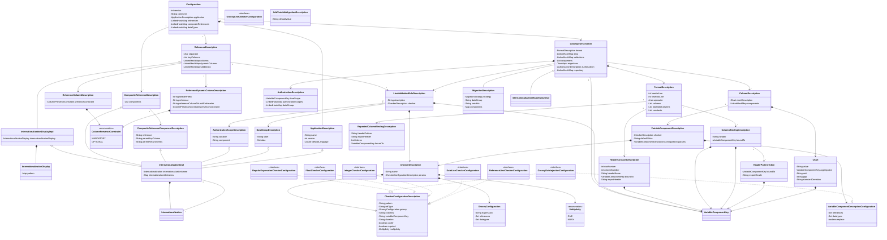

```mermaid
     classDiagram 
      class Configuration{
          -int version
          -String comment
          -ApplicationDescription application
          -LinkedHashMap<String, ReferenceDescription> references
          -LinkedHashMap<String, CompositeReferenceDescription> compositeReferences
          -LinkedHashMap<String, DataTypeDescription> dataTypes
      }
      Configuration *-- ApplicationDescription
      Configuration "1"-->"*"ReferenceDescription
      Configuration "1"-->"*"CompositeReferenceDescription
      Configuration "1"-->"*"DataTypeDescription
      class InternationalizationDisplayImpl{
          -InternationalizationDisplay internationalizationDisplay
      }
      InternationalizationDisplayImpl *-- InternationalizationDisplay
      InternationalizationDisplayImpl <|-- InternationalizationImpl
      class InternationalizationImpl{
          -Internationalization internationalizationName
          -Map<String, Internationalization> internationalizedColumns
      }
      InternationalizationImpl *-- Internationalization
      InternationalizationImpl "1"--"*" Internationalization
      class InternationalizationDisplay{
          -Map<Locale, String> pattern
      }
      class Internationalization{
      }
      class ReferenceDescription{
          -char separator
          -List<String> keyColumns
          -LinkedHashMap<String, ReferenceColumnDescription> columns
          -LinkedHashMap<String, ReferenceDynamicColumnDescription> dynamicColumns
          -LinkedHashMap<String, LineValidationRuleDescription> validations
          
      }
      ReferenceDescription "1"-->"*"ReferenceColumnDescription
      ReferenceDescription "1"-->"*"ReferenceDynamicColumnDescription
      ReferenceDescription "1"-->"*"LineValidationRuleDescription
      ReferenceDescription <|-- InternationalizationDisplayImpl
      class ReferenceColumnDescription{
          -ColumnPresenceConstraint presenceConstraint

      }
      ReferenceColumnDescription *--> ColumnPresenceConstraint

      class ReferenceDynamicColumnDescription{
          -String headerPrefix
          -String reference
          -String referenceColumnToLookForHeader
          -ColumnPresenceConstraint presenceConstraint
      }
      ReferenceDynamicColumnDescription *--> ColumnPresenceConstraint

      class ColumnPresenceConstraint{
        <<enumeration>>
        MANDATORY
        OPTIONAL
      }
      class CompositeReferenceDescription{
          -List<CompositeReferenceComponentDescription> components
      }
      CompositeReferenceDescription "1"-->"*"CompositeReferenceComponentDescription
      CompositeReferenceDescription <|-- InternationalizationImpl
      class CompositeReferenceComponentDescription{
          -String reference
          -String parentKeyColumn
          -String parentRecursiveKey
      }
      CompositeReferenceComponentDescription <|-- InternationalizationImpl
      
      class DataTypeDescription{
          -FormatDescription format
          -LinkedHashMap<String, ColumnDescription> data
          -LinkedHashMap<String, LineValidationRuleDescription> validations
          -List<VariableComponentKey> uniqueness
          -TreeMap<Integer, List<MigrationDescription>> migrations
          -AuthorizationDescription authorization
          -LinkedHashMap<String, String> repository

      }
      DataTypeDescription *--> AuthorizationDescription
      DataTypeDescription *--> FormatDescription
      DataTypeDescription "1"-->"*"ColumnDescription
      DataTypeDescription "1"-->"*"LineValidationRuleDescription
      DataTypeDescription "1"-->"*"VariableComponentKey
      DataTypeDescription -- MigrationDescription
      DataTypeDescription <|-- InternationalizationMapDisplayImpl
      
      class LineValidationRuleDescription{
          -String description
          -CheckerDescription checker
      }
      LineValidationRuleDescription *--> CheckerDescription
      class AuthorizationDescription{
          -VariableComponentKey timeScope
          -LinkedHashMap<String, AuthorizationScopeDescription> authorizationScopes
          -LinkedHashMap<String, DataGroupDescription> dataGroups
      }
      LineValidationRuleDescription *--> VariableComponentKey
      LineValidationRuleDescription "1"-->"*"AuthorizationScopeDescription
      LineValidationRuleDescription "1"-->"*"DataGroupDescription
      class AuthorizationScopeDescription{
          -String variable
          -String component
      }
      AuthorizationScopeDescription <|-- InternationalizationImpl
      class FormatDescription{
          -int headerLine
          -int firstRowLine
          -char separator
          -List<ColumnBindingDescription> columns
          -List<RepeatedColumnBindingDescription> repeatedColumns
          -List<HeaderConstantDescription> constants

      }
      FormatDescription "1"-->"*"ColumnBindingDescription
      FormatDescription "1"-->"*"RepeatedColumnBindingDescription
      FormatDescription "1"-->"*"HeaderConstantDescription
      class HeaderConstantDescription{
          -int rowNumber
          -int columnNumber
          -String headerName
          -VariableComponentKey boundTo
          -String exportHeader
      }
      HeaderConstantDescription *--> VariableComponentKey
      class ColumnBindingDescription{
          -String header
          -VariableComponentKey boundTo
      }
      ColumnBindingDescription *--> VariableComponentKey
      class RepeatedColumnBindingDescription{
          -String headerPattern
          -String exportHeader
          -List<HeaderPatternToken> tokens
          -VariableComponentKey boundTo
      }
      ColumnBindingDescription *--> VariableComponentKey
      ColumnBindingDescription "1"--> "*"HeaderPatternToken
      class HeaderPatternToken{
          -VariableComponentKey boundTo
          -String exportHeade
      }
      HeaderPatternToken *--> VariableComponentKey
      class ColumnDescription{
          -Chart chartDescription
          -LinkedHashMap<String, VariableComponentDescription> components
      }
      ColumnDescription *--> Chart
      ColumnDescription "1"--> "*"VariableComponentDescription
      class Chart{
          -String value
          -VariableComponentKey aggregation
          -String unit
          -String gap
          -String standardDeviation
      }
      Chart *--> VariableComponentKey
      class VariableComponentDescription{
          -CheckerDescription checker
          -String defaultValue
          -VariableComponentDescriptionConfiguration params
      }
      VariableComponentDescription *--> CheckerDescription
      VariableComponentDescription *--> VariableComponentDescriptionConfiguration
      class VariableComponentDescriptionConfiguration{
          -Set<String> references
          -Set<String> datatypes
          -boolean replace
      }
      GroovyDataInjectionConfiguration..|>VariableComponentDescriptionConfiguration
      class GroovyDataInjectionConfiguration{
          <<interface>>
      }
      class RegularExpressionCheckerConfiguration{
          <<interface>>
      }
      class FloatCheckerConfiguration{
          <<interface>>
      }
      class IntegerCheckerConfiguration{
          <<interface>>
      }
      class DateLineCheckerConfiguration{
          <<interface>>
      }
      class ReferenceLineCheckerConfiguration{
          <<interface>>
      }
      class GroovyLineCheckerConfiguration{
          <<interface>>
      }
      class CheckerDescription{
          -String name
          -CheckerConfigurationDescription params
      }
      CheckerDescription *--> CheckerConfigurationDescription
      class CheckerConfigurationDescription{
          -String pattern
          -String refType
          -GroovyConfiguration groovy
          -String columns
          -String variableComponentKey
          -String duration
          -boolean codify
          -boolean required
          -Multiplicity multiplicity

      }
      CheckerDescription *--> GroovyConfiguration
      CheckerDescription *--> Multiplicity
      GroovyDataInjectionConfiguration..|>CheckerConfigurationDescription
      RegularExpressionCheckerConfiguration..|>CheckerConfigurationDescription
      FloatCheckerConfiguration..|>CheckerConfigurationDescription
      IntegerCheckerConfiguration..|>CheckerConfigurationDescription
      DateLineCheckerConfiguration..|>CheckerConfigurationDescription
      ReferenceLineCheckerConfiguration..|>CheckerConfigurationDescription

      class Multiplicity{
          <<enumeration>>
          ONE
          MANY
      }
      class GroovyConfiguration{
          -String expression
          -Set<String> references
          -Set<String> datatypes
      }
      class DataGroupDescription{
          -String label
          -Set<String> data
      }
      DataGroupDescription <|-- InternationalizationImpl

      class ApplicationDescription{
          -String name
          -int version
          -Locale defaultLanguage
      }
      ApplicationDescription <|-- InternationalizationImpl
      class MigrationDescription{
          -MigrationStrategy strategy
          -String dataGroup
          -String variable
          -Map<String, AddVariableMigrationDescription> components
      }
      class AddVariableMigrationDescription{
          -String defaultValue
      }
```