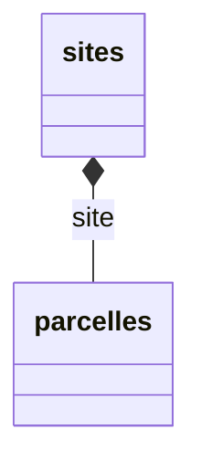
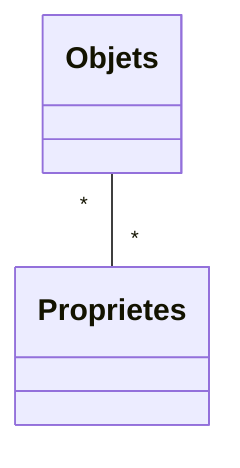
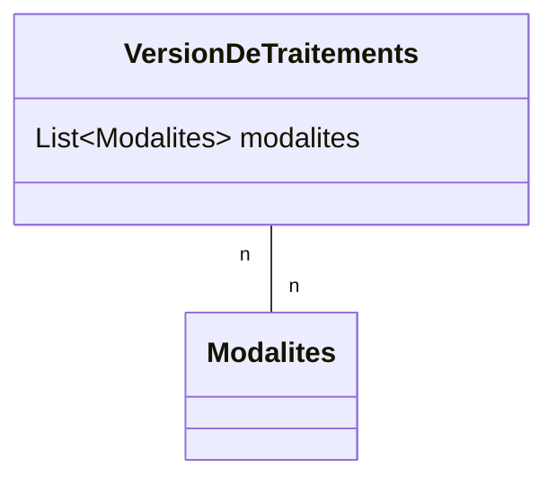

# Introduction

Ce document permet d'aider un gestionnaire de SI à décrire son domaine dans un fichier de configuration, qui une fois déposé dans l'application, génèrera une base de données et les outils permettant de l'alimenter et de la consulter.

Chaque fichier de configuration déposé génèrera un schéma dédié dans la base de données.

## <a id="prealable" />Préalable
Avant de commencer l'écriture du fichier de configuration, il faut travailler à définir le modèle des données que vous voulez traiter dans la base de données.

Vous avez en votre possession un certain nombre de fichiers (format csv) contenant les données. Un fichier de données respecte un certain format. En particulier les en-têtes de colonnes doivent être fixés et le contenu sous un en-tête a un format déterminé (date, valeur flottante, entier, texte..).

Chaque format de fichier correspond à ce que l'on appellera un type de données. Il regroupe plusieurs variables correspondant à :
- une thématique,
- un pas de temps,
- une structuration des données
- ...

Chaque ligne peut être identifiée par sous-ensemble de colonnes. Cet identifiant permet de créer ou de mettre à jour une donnée, selon qu'elle est ou non déjà présente en base.

Chaque ligne porte, sur une ou plusieurs colonnes, une information de temporalité.

Chaque ligne porte aussi, sur une ou plusieurs colonnes, des informations sur le contexte d'acquisition des variables des autres colonnes.

On peut vouloir aussi faire figurer dans la base de données certaines informations non présentes dans le fichier de données.

- des informations liées aux variables que l'on fournit sous la forme de fichier de référentiels (description de site, description de méthodes, description d'unités, description d'outils...)
- des informations constantes, ne dépendant pas du fichier (par exemple l'unité de la variable)
- des informations constantes pour l'ensemble du fichier (par exemple le site correspondant aux valeurs du fichier). Ces informations pouvant être décrites dans un cartouche, avant l'en-tête de colonne ou juste sous l'en-tête de colonne (valeur minimum ou maximum)
- des informations calculées à partir d'informations du fichier, d'informations des référentiels déjà déposés ou même des données déjà publiées.

### exemple
Supposons que l'on ait un fichier de données météorologiques


```csv
  Région;Val de Loire;;;
  Période;06/2004;;;
  Date de mesure:Site;Précipitation;Température moyenne;Température minimale;Température maximale
  01/06/2004;Os1;30;20;10;24
  07/06/2004;Os1;2;22;14;27
  07/06/2004;Os2;0;21;9;28
```
- La temporalité est portée par la colonne "Date de mesure".
- Le contexte est porté par l'information du cartouche d'en-tête "Région" et la colonne "Site".
- On identifie 4 variables:
  - _date_ au format dd/MM/yyyy (format au sens SQL : https://www.postgresql.org/docs/current/functions-formatting.html#FUNCTIONS-FORMATTING-DATETIME-TABLE). Cette variable n'a qu'une seule composante "day". On note que les moyennes sont calculées à la journée.
  - _localization_ qui fait référence à un site de la colonne "Site", avec deux composantes (site et region)
  - _precipitation_ qui correspond à la pluviométrie de la colonne "Précipitation" avec deux composantes (value,unit=mm)
  - _temperature_ qui se réfère aux colonnes "Température moyenne", "Température minimale" et "Température maximale" avec 4 composantes (value,min,max,unit=°C)

Du coup, on peut aussi définir des référentiels pour préciser ses informations

__region.csv__
```csv
code ISO 3166-2;nom
FR-ARA	Auvergne-Rhône-Alpes
FR-BFC	Bourgogne-Franche-Comté
FR-BRE	Bretagne
FR-CVL	Centre-Val de Loire
FR-COR	Corse
FR-GES	Grand Est
FR-HDF	Hauts-de-France
FR-IDF	Île-de-France
FR-NOR	Normandie
FR-NAQ	Nouvelle-Aquitaine
FR-OCC	Occitanie
FR-PDL	Pays de la Loire
FR-PAC	Provence-Alpes-Côte d'Azur
```

__site.csv__
```csv
nom:Date de création;region
Os1;01/01/2000;FR-CVL
Os2;01/01/2000;FR-CVL
```
Les sites font référence aux régions.

__unite.csv__
```csv
nom;nom_fr;nom_en;code
temperature;Température;Temperature;°C
precipitation;Précipitation;Precipitation;mm
```
Le fait de dire que l'unité d'une donnée fait référence au référentiel unite signifie :
- que l'unité doit être présente dans ce référentiel,
- que l'on ne pourra pas supprimer une unité du référentiel si on y a fait référence.

On aurait pu rajouter des responsables de site et de région, des descriptions des variables, des intervalles de valeurs...

Ainsi nous avons pu faire une analyse de notre domaine et le format des fichiers qui s'y rapportent. Nous pouvons commencer l'écriture du fichier de configuration.

### Vocabulaire

####  <a id="code" />Clefs et code

Dans un fichier, on définit une ou plusieurs colonnes qui correspondent à la clef d'idendification de la ligne. Cette clef naturelle permet lors d'une insertion / suppression de retrouver cette ligne dans la base de données et, si elle est présente, de la mettre à jour. Dans le cas contraire, une nouvelle ligne est créée.

##### code

Pour enregistrer ces clefs dans la base de données, et pour éviter les erreurs, les clefs sont codées. Le code utilisé n'autorise que les chiffres, les lettres minuscules et majuscules ainsi que le caractère souligné (underscore).

Cependant, pour permettre une plus grande souplesse, les accents sont supprimés, les majuscules sont remplacées par les minuscules, les espace et les tirets (-) sont remplacés par des _ et les autres caractères sont remplacés par leur nom ascii en majuscules.

- L'année de départ -> lAPOSTROPHEannee_de_depart
- µmol m-2 s-1 -> MICROSIGNmol_m2_s1
- m²/m² -> mSUPERSCRIPTTWOSOLIDUSmSUPERSCRIPTTWO
- °C -> DEGREESIGNc

Ainsi les valeurs Elévation, élévation, elevation ou même EléVaTioN renvoient toutes le même code.

Ces transformations sont faites de manière transparente.

> :information_source : Quand on fait référence à un référentiel, que cela soit pour un type de données ou pour un autre référentiel, on utilise la clef naturelle de ce référentiel. Cependant, il sera possible de demander la mise en code de la valeur avant de rechercher son existence dans le référentiel de référence.

##### Clef naturelle.

Elle est construite en concaténant les valeurs des différentes colonnes composant la clef. Le signe de concaténation est le double underscore '__'.

- Forme géométrique de la colonie + prisme -> forme_geometrique_de_la_colonie__prisme
- Ensoleillement + Ensoleillé -> ensoleillement__ensoleille
- Piégeage en montée + Couleur des individus -> piegeage_en_montee__couleur_des_individus

##### Clef hiérarchique

Elle est construite en concaténant les clefs naturelles de différents référentiels. Le signe de concaténation de la clef hiérarchique est le point '.' 

Ainsi si on a une parcelle "1", dans le site "Site 1" du type de site "Site d'étude" :

| référentiel  | Nom                                           | Clef naturelle                                                                                                                      | Clef hiérarchique                                                                                                                                                                      |
|--------------|-----------------------------------------------|-------------------------------------------------------------------------------------------------------------------------------------|----------------------------------------------------------------------------------------------------------------------------------------------------------------------------------------|
| Type de site | <span style="color:blue"> Site étude</span> | <span style="color:blue"> site_etude</span>                                                                              | <span style="color:blue">site_etude</span>                                                                                                                                  |
| Site         | <span style="color:green">Site 1</span>       | <span style="color:blue">site_etude</span>__ <span style="color:green">site_1</span>                                     | <span style="color:blue">site_etude</span>.<span style="color:blue">site_etude</span> __<span style="color:green">site_1</span>                                  |
| Parcelle     | <span style="color:red">1</span>              | <span style="color:blue"> site_etude</span>__  <span style="color:green">site_1</span>__<span style="color:red">1</span> | <span style="color:blue">site_etude</span>.<span style="color:blue">site_etude</span> __<span style="color:green">site_1</span>.<span style="color:red">1</span> |


#### <a id="referentiels" /> Référentiels
__references__: Un ensemble d'informations permettant de préciser le contexte de la mesure ou de l'observation. 

En déportant ces informations dans des fichiers __references__, on évite la répétition d'informations. On utilisera la clef d'une information pour y faire référence.

#### <a id="datatypes" />Types de données
__data__ : un ensemble de données correspondant à une thématique et un format de fichier commun.

__variable__ : correspond à un ensemble de données, qualifiant ou se rapportant à une variable de mesure, d'observation, d'informations, de temporalité ou de contexte.

__component__ : un ensemble de valeur qui servent à décrire une variable (valeur, écart type, nombre de mesures; indice de qualité; méthode d'obtention...)

__localisationScope__ :  une ou des informations contextuelles (variable-component) qui ont du sens pour limiter les autorisations.

__timeScope__ :  l'information de temporalité d'une ligne ayant du sens pour limiter des authorisations à une période.

__dataGroups__ : un découpage, sous forme de partitionnement de variables, en un ensemble de groupes de variables (__dataGroups__), pour limiter les droits à la totalité ou à des sous ensembles de variables.

On pourrait dans notre exemple distinguer 3 __dataGroups__:
- informations(date et localization)
- precipitation(precipitation)
- temperature (temperature)
 
Mais on peut aussi faire le choix d'un seul groupe
- all(date,localization,precipitation,temperature)
 
Ou de 4 groupes en découpant informations en date et localization

# <a id="aidefichier" /> Aide fichier à la rédaction du fichier de configuration

## <a id="creation" />La création :
Vous trouverez ci-dessous un exemple de fichier Yaml fictif qui décrit les parties attendues dans celui-ci pour qu'il
soit valide. **Attention le format Yaml est sensible** il faut donc respecter l'indentation.

Il y a 5 parties (<span style="color: orange">sans indentation</span>) attendues dans le fichier :

* version,
* application,
* references,
* compositeReferences,
* dataTypes

<span style="color: orange">l'indentation du fichier yaml est très importante.</span>


### <a id="description-du-fichier" />Description du fichier

Informations sur le fichier lui-même

#### Version de l'analyseur (parser) du fichier de configuration.
Soit version actuelle du site qui est 1 actuellement. Il faut avoir en tête que lorsque l'application évolue et que la version de l'analyseur s'incrémente, le fichier de configuration peut ne plus être valide.


``` yaml
version: 1
```

<span style="color: orange">*version* n'est pas indenté.</span>

#### On présente l'application avec son nom et la version du fichier de configuration :
(on commence par la version 1)

S'il y a déjà une application du même nom, mais que l'on a fait des modifications dans le fichier, on incrémente la  version.

``` yaml
application:
  name: application_nom
  internationalizationName:
    fr: Ma première application
    en: My first application
  version: 1
```

>  Les sections d'internationalisation ne sont pas obligatoires, mais permettent une internationalisation des interfaces.


<span style="color: orange">*application* n'est pas indenté. *name*, *internationalizationName* et *version* sont indentés de 1.</span>

>  Vous trouverez le formalisme d'un fichier yaml sur cette [page](https://docs.ansible.com/ansible/latest/reference_appendices/YAMLSyntax.html).

Certains éditeurs de texte permettent d'écrire un yaml avec colorisation et mise en relief des erreurs. Par exemple l'éditeur de texte ou kate (linux) ou bien Notepad++ (windows)

### <a id="references" />Description référentiels
On décrit les référentiels dans la partie *references*, on y liste les noms des colonnes souhaitées (dans [*columns*](#columns), [*computedColumns*](#computedColumns) ou [*dynamicColumns*](#dynamicColumns)) ; en précisant la liste de colonnes qui forment la clef naturelle (dans [*keyColumn*](#keuColumns)).
On pourra aussi préciser des règles de validations sur une ou plusieurs colonnes dans la section [*validations*](#referencesValidation) :

- une [__columns__](#columns) est une colonne du fichier
- une [__computedColumns__](#computedColumns) est une colonne qui n'est pas présente dans le fichier et dont la valeur est une constante ou le résultat d'un calcul.
- une [__dynamicColumns__](#dynamicColumns) est un ensemble de colonnes dont la clef est la concaténation d'un préfixe et d'une valeur d'un référentiel. Par exemple s'il existe un référentiel "propriétés" avec les valeurs (couleur, catégorie, obligatoire), on pourrait avoir dans un autre référentiel (en utilisant le préfixe "pts_") pts_couleur, pts_catégorie et pts_obligatoire, en les déclarant comme [__dynamicColumns__](#dynamicColumns).
-

#### <a id="columns" />Description des colonnes (columns)

Pour le modèle de référentiels,



et pour les fichiers :


- __sites.csv__

| nom du site |
| ------ |
| site1 |
| site2 |

- __parcelles.csv__

| site | nom de la parcelle |
| ------ | ------ |
| site1 | 1 |
| site2 | 1 |

on aura le yaml suivant

``` yaml
references:
  agroécosystème:
    keyColumns: [nom]
    columns:
      nom:
    nom
  sites:
  #donnée de référence avec une clef sur une colonne
    keyColumns: [nom du site]
    columns:
      Agroécosystème:
      nom du site:
  parcelles:
  #donnée de référence avec une clef sur deux colonnes
    keyColumns: [site,nom de la parcelle]
    columns:
      site:
      nom de la parcelle:
```

>  Le nom du référentiel est libre. Cependant, pour ceux réutilisés ailleurs dans l'application, il est préférable de n'utiliser que des minuscules et underscores sous peine de générer des erreurs dans les requête sql ou la création des vues :

```
exemple: mon_nom_de_referentiel
```

>  Le nom des colonnes des references doivent être courts pour ne pas être tronqués lors de la création des vues de l'application.
Les noms des colonnes dans la base de données sont limités à 63 caractères. Dans les vues, ce nom est une concaténation du nom du référentiel et du nom de la colonne
```
exemple: type_de_sites__nom_du_type_de_site
```


Pensez à mettre le même nom de colonnes dans le fichier *.csv* que dans la partie *columns* du fichier yaml.

>  <span style="color: orange">*references* n'est pas indenté. *sites* et *parcelles* sont indentés de 1. *keyColumns* et
*columns* sont indentés de 2. Le contenu de *columns* seront indenté de 3.</span>

On peut rendre une colonne facultative en rajoutant dans la description de la colonne l'information : 
```yaml
references:
  maColonneFacultative:
    presenceConstraint: OPTIONAL
```

La valeur par défaut est :
```yaml
    presenceConstraint: MANDATORY
```


#### <a id="computedColumns" />Colonnes calculées (computed columns)

Une colonne calculée est une colonne qui n'est pas présente dans le fichier. Ses valeurs sont issues du résultat d'un calcul.
``` yaml
references:
  computedColumns:
    date_iso:
    defaultValue: > 
    #une valeur par défaut qui est une expression groovy (
    #une chaîne entre cotes  "ceci est une valeur par défaut", 
    #un nombre, sont des expressions groovy.
      import java.time.LocalDate
      import java.time.format.DateTimeFormatter
      return LocalDate.parse(datum.date, DateTimeFormatter.ofPattern('dd/MM/yyyy'))
       .atStartOfDay()
       .format(DateTimeFormatter.ISO_DATE_TIME)
    checker:
     name: Date
     params:
        pattern: yyyy-MM-ddTHH:mm:ss

```

#### <a id="dynamicColumns" />Colonnes dynamiques (dynamic columns)

Les colonnes dynamiques permettent de traduire une relation n-n entre deux référentiels. Par exemple entre un objet et ses propriétés.


Dans le référentiel Propriétés on liste les différentes propriétés qui sont observées sur l'objet

Dans le référentiel Objet, on donne la liste des propriétés observées pour chacune des propriétés dans une colonne avec comme en-tête le nom de la propriété préfixée.

__propriétés.csv__
``` csv
nom de la proprieté;isQualitative
couleur:true
nombre_de_faces:false
indice:false
```

__objet.csv__
``` csv
nom de l'objet;pt_couleur;pt_nombre_de_faces;pt_indice
cube;bleu;6;7
tétraèdre;rouge;4;2
```
On définira le référentiel objet de la manière suivante

``` yaml
  references:
   proprietes;
    columns:
     nom de la proprieté
     isQualitative
    keyColumns:[nom de la proprieté]
   objet;
    columns:
     nom de l'objet
    keyColumns:[nom de l'objet]
    dynamicColumns:
      propriétés de taxons:
        internationalizationName: 
        # une section d'internationalisation pour afficher 
        # le nom de la colonne propriétés de taxons
          fr: Proprétés de Taxons
          en: Properties of Taxa
        headerPrefix: "pt_" 
        # les colonnes commençant par ce préfixe seront comprises 
        # comme étant des colonnes dynamiques
        reference: proprietes_taxon 
        #le référentiel qui contient les noms des colonnes
        referenceColumnToLookForHeader: nom de la propriété_key 
        # la colonne qui contient  les noms des colonnes 
        # dans le référentiels sus désigné.
```


#### Colonnes non déclarées

Si le fichier contient des colonnes non déclarées, une erreur est lancée lors du dépôt. Si toutefois on souhaite que le fichier puisse être déposé, on peut rajouter dans references l'information <code>allowUnexpectedColumns:true</code>


``` yaml
    references:
      allowUnexpectedColumns: true

```
#### On peut poser des contraintes sur les données de référence

##### [Utilisation de vérificateurs (checker)](#ReferencesChecker)

Pour chaque colonne, on peut ajouter des vérificateurs.
- vérifier la nature d'un champ (float, integer, date)  ( Integer, Float, Date)
- vérifier une expression régulière ( RegularExpression)
- ajouter un lien avec un référentiel (Reference)
- vérifier un script (le script renvoyant true) ( GroovyExpression)

``` yaml
  sites:
  #donnée de référence avec une clef sur une colonne
    keyColumns: [nom du site]
    columns:
      Agroécosystème:
      nom du site:
        checker:
          name: Reference #contrainte de type référentiel
          params:
            refType: sites #qui porte sur le référentiel site
            required: true # la valeur ne peut être manquante
            transformation:
              #on transforme la valeur en son code avant de la tester
              codify: true 
      date:
        checker:
          name: Date
          params:
            pattern: dd/MM/yyyy
            required: true
      numéro:
        checker:
          name: Integer
```

##### [Utilisation de validations portant sur une ou plusieurs colonnes](#ReferencesChecker)

Les contraintes se définissent pour chacune des données de référence. Soit dans la définition de la colonne elle-même, soit dans la section [validation](#referencesValidation).

Chaque règle de validation peut porter sur plusieurs colonnes de la donnée de référence.
Elle comporte une description et un [checker](#ReferencesChecker) (Reference, Integer, Float, RegularExpression, Date, GroovyExpression).


``` yaml

  types_de_donnees_par_themes_de_sites_et_projet:
    validations:
      projetRef: # la clef d'une validation
        internationalizationName:
         fr: "référence au projet" # la description en français
         en: "project reference" # la description en anglais
        checker: # le checker de validation
          name: Reference #Le checker à utiliser
          params: # liste de paramètres (dépend du checker choisi)
            refType: projet #pour le checker référence la donnée référencée
        columns: [nom du projet] 
        # liste des colonnes sur lequel s'applique le checker
      sitesRef:
        internationalizationName:
         fr: "référence au site" # la description en français
         en: "site reference" # la description en anglais
        checker:
          name: Reference
          params:
            refType: sites
        columns: [nom du site]
      themesRef:
        internationalizationName:
         fr: "référence au thème" # la description en français
         en: "thematic reference" # la description en anglais
        checker:
          name: Reference
          params:
            refType: themes
        columns: [nom du thème]

      checkDatatype:
        internationalizationName:
         fr: "existence du type de données" # la description en français
         en: "existence of the data type" # la description en anglais
        checker:
          name: GroovyExpression # utilisation d'un script groovy de validation
          params:
            groovy:
              expression: >
                String datatype = Arrays.stream(
                  datum.get("nom du type de données")
                  .split("_")
                 )
                .collect{it.substring(0, 1)}.join();
                return application.getDataType().contains(datatype);
      checkDateFormat:
        internationalizationName:
          fr: "date au format dd/MM/yyyy" # la description en français
          en: "date in dd/MM/yyyy format" # la description en anglais
        checker:
         name: Date
         params:
           pattern:dd/MM/YYYY
        columns : [Date de début, Date de fin] 
        # les colonnes du référentiel concernées par la vérification.

```

##### <a id="ReferencesChecker" />Vérificateurs

Contenu de la section params :

| name           | References | Integer | Float | Date | GroovyExpression | RegularExpression | *                                                                      |
|----------------|-----------|--------|------|------|------------------|-------------------|------------------------------------------------------------------------|
| refType        | X         |        |      |      |                  |                   | Le référentiels de jointure                                            |
| pattern        |           |        |      |      |                  | X                 | Le pattern pour une expression régulière                               |
| transformation | X         | X      | X    | X    | X                | X                 | La définition d'une transformation à faire avant de vérifier la valeur |
| required       | X         | X      | X    | X   | X    | X                | La valeur ne peut être nulle (true)                                    |
| multiplicity   | X         |        |      |      |      |                  | La colonne contient un tableau de référence (true)                     |
| groovy         |           |        |       |     | X    |                  | La définition d'une expression groovy                                  |
| duration       |           |        |      | X |         |                  | Pour une date la durée de cette date                                   |

> :information_source : Une durée est définie au sens SQL d'un [interval](https://www.postgresql.org/docs/current/functions-datetime.html#OPERATORS-DATETIME-TABLE) ('1 HOUR', '2 WEEKS', '30 MINUTES').

On peut rajouter une section [transformations](#transformations) pour modifier la valeur avant sa vérification :

Cette <a id="transformation" />transformation peut être configurée avec
- codify : la valeur sera alors échappée pour être transformée en clé naturelle (Ciel orangée -> ciel_orange)
- groovy : permet de déclarer une transformation de la valeur avec une expression Groovy (qui doit retourner une chaîne de caractère)


La section groovy accepte trois paramètres
- expression : une expression groovy (pour le checker GroovyExpression doit renvoyer true si la valeur est valide)
- references : une liste de référentiels pour lesquels on veut disposer des valeurs dans l'expression
- datatypes : une liste de datatypes pour lesquels on veut disposer des valeurs dans l'expression


> :alert: La différence entre une section groovy de la section params d'un checker __groovy__ et une section groovy de la section transformation de la section params, tient dans le fait que pour un checker groovy l'expression renvoyée est un booléen tandis que dans la transformation l'expression groovy renvoie une nouvelle valeur.


Pour les checkers GroovyExpression et les transformations Groovy, on récupère dans le script des informations :

    datum : les valeurs de la ligne courante.
      On récupère la valeur d'un variable-component -> 
        datum.get("nom de la variable").get("nom du composant")
    application : le yaml de l'application
    references: les valeurs d'une donnée de référence spécifique;
      Il faut renseigner dans params la clef "references" qui définit 
        les données de références accessibles dans references.
      -> references.get("nom de la reference").getRefValues().get("nom de la colonne")
    referencesValues : idem que references;
      -> referencesValues.get("nom de la reference").get("nom de la colonne")
    datatypes : idem que references pour les datatypes. 
      Il faut renseigner le param datatypes
      -> datatypes.get("nom du datatype").getValues().get("nom de la colonne")
    datatypesValues : idem que datatypes
      -> datatypesValues.get("nom du datatype").get("nom de la colonne")
> :information_source: On peut aussi passer des constantes dans le script

``` yaml
       expression : >
          import java.time.LocalDate
          import java.time.format.DateTimeFormatter

          LocalDate minDate = LocalDate.of(2014,1,1)
          LocalDate maxDate = LocalDate.of(2022,1,1)
          LocalDate date = LocalDate.parse(
            datum.date, 
            DateTimeFormatter.ofPattern('dd/MM/yyyy')
          )
          return date.isBefore(maxDate) && date.isAfter(minDate)
```

### <a id="compositeReferences" />Définition de clefs composites entre différentes références

Une clef composite permet de définir une hiérarchie entre différentes données de référence.

Dans l'exemple ci-dessous il y a une relation oneToMany entre les deux données de référence sites et
parcelles.

La [clef naturelle](#keyColumns) permet de distinguer deux lignes distinctes. Elle est juste construite à partir de la concaténation des valeurs de colonnes.

La clef composite rajoute une hiérarchie entre les données de référence. Dans l'exemple ci-dessous pour référencer
une ligne site, on utilise sa clef naturelle __site1__1__, une clef hiérarchique est aussi créé : __site1.site1__1__

> :information_source: On peut créer une clef naturelle sur une colonne dont chaque valeur est unique (une colonne clef technique par exemple), que cette colonne soit donnée par le fichier ou bien calculée.
>
> La clef composite est une concaténation de toutes les clefs naturelles qui la compose (séparateur .) cf. le chapitre [code](#code)

Pour créer une clef à partir d'une chaîne, on peut utiliser un checker et en renseignant la section codify de params.


``` yaml
compositeReferences:
  localizations:
    components:
      - reference: sites
      - reference: parcelles
        parentKeyColumn: "site"
```

>   <span style="color: orange">*compositeReferences* n'est pas indenté. *localizations* est indenté de 1. *components* est
indenté de 2. *- reference* et *- parentKeyColumn* sont indentés de 3. Le *reference* qui est sous parentKeyColumn est
indenté de 4.</span>

Il est possible de définir une reference composite récursive dans le cas de données de références qui font référence à elle-même. En ce cas, on utilisera la clef `parentRecursiveKey` pour faire référence à la colonne parent du même fichier. C'est d'ailleurs le seul moyen de référencer un référentiel sur lui-même.
``` yaml

compositeReferences:
  taxon:
    components:
      - parentRecursiveKey: nom du taxon superieur
        reference: taxon
```

Voir aussi la section [autorisations](#authorizations) quant à l'utilisation des clefs composites.

#### Relation entre deux référentiels avec multiplicité

Lorsqu'un fichier CSV contient une colonne dont le contenu est une liste de clés naturelles pointant vers un autre référentiel, on parle de multiplicité.

On peut configurer un checker de type `Reference` de façon à prendre en compte cette multiplicité.

Par exemple, un fichier CSV de modalités dont la clé naturelle est composée de la seule colonne code :



Une version d'un traitement est définie par une liste de modalités (plus ou moins d'engrais, plus ou moins de pesticide, pâture ou non...),

```csv
Variable de forcage;code;nom_fr;nom_en;description_fr;description_en
Fertilisation;F0;nulle;nulle;Aucune fertilisation;Aucune fertilisation
Utilisation;U0;Sol nu;Sol nu;Maintient du sol en sol nu;Maintient du sol en sol nu
Utilisation;UA;Abandon;Abandon;Pas de traitement;Pas de traitement
Utilisation;UC;Culture;Culture;Sol en culture lors d'une rotation;Sol en culture lors d'une rotation
Utilisation;UF;Fauche;Fauche;Prairies fauchées;Prairies fauchées
Utilisation;UP;Pâture;Pâture;Prairies pâturées;Prairies pâturées
```

accompagné de ce fichier `version_de_traitement.csv` :

```
site;traitement;version;date début;date fin;commentaire_fr;commentaire_en;modalites
Theix;T4;1;01/01/2005;;version initiale;initial version;F0,UA
Theix;T5;1;01/01/2005;;version initiale;initial version;F0,UF
```

On voit que la colonne `modalites` est multi-valuée : elle contient plusieurs codes vers des clés du fichier modalités.

On paramètre le checker avec la `multiplicity: MANY`. Cela donne, par exemple, un YAML de la forme (voir la section  _validations_ de _version_de_traitement_) :

```yaml
references:
  modalites:
    keyColumns: [code]
    columns:
      Variable de forcage:
      code:
      nom_fr:
      nom_en:
      description_fr:
      description_en:
  version_de_traitement:
    keyColumns: [site, traitement]
    columns:
      site:
      traitement:
      version:
      date début:
      date fin:
      commentaire_fr:
      commentaire_en:
      modalites:
        internationalizationName:
         fr: "référence aux modalités"
         en: "reference to conditions"
        checker:
          name: Reference
          params:
            refType: modalites
            multiplicity: MANY
            transformation:
              codify: true
```
> :information_source: dans la base, modalités sera un tableau.

### <a id="datatypes" />Description des *dataTypes*

Pour enregistrer un type de données, il faut déclarer
- le [data](#data) : ce qui sera enregistré en base de données [*section data*](#data)
- le [format du fichier](#format) ([*section format*])(#format)
- les [autorisations](#authorizations) ([*section authorizations*](#authorizations))
- les [validations](#datatypesValidation) de chaque ligne

Nous regrouperons les données par nom des types de données que l'on souhaite importer (nom_de donnees) correspondant à un format de fichier (*nomDonnée*.csv)</h4>

>  Pour éviter les erreurs, n'utilisez que des minuscules et des _ dans le nom des types de données. Utilisez la section internationalisationName pour donner un nom plus explicite.

``` yaml
dataTypes:
  nom_donnees_csv:
   internationalizationName:
    fr: Le nom des données.
    en: The datatype name.
```

<span style="color : orange">*dataTypes* n'est pas indenté. *nomDonnée* est indenté de 1.</span>

#### <a id="data" />*data*
La section data permet de décrire le schéma des données enregistrées en base. Les données sont enregistrées comme une
liste de *variables* pouvant avoir plusieurs composantes (*components*).
Les *variables/components* peuvent être des constantes ou des valeurs calculées, provenir d'un en-tête ou provenir des colonnes.

*date*, *localization* et *prélèvement* sont des exemples de nom de variable qui regrouperont plusieurs composantes.
On fait la liste de *components* pour chaque variable.

Par exemple *day* et *time* sont les composantes (*components*) de la variable *date*.

On vérifie leurs formats grace aux *checker* -> *name* est le nom du checker et *params* permet de définir les
paramètres du format via le *pattern*.
Voici quelque possibilité de *pattern* possible pour les dates et heures :

|pattern   | exemple 1    | exemple 2   |
| -------- |   ---------  | ---------   |
|dd/MM/yy  |31/01/21      | 31/12/21    |
|dd/MM/yyyy|31/01/2021    |31/12/2021   |
|MM/yyyy   |01/2021       |12/2021      |
|M/yyyy    |1/2021        |12/2021      |
|HH:mm     |13:00         |01:00        |
|HH:mm:ss  |13:00:00      |01:00:00     |
|dd/MM/yy HH:mm:ss|31/01/21 13:00:00|31/12/21 01:00:00|

<span style="color : orange">Pour les dates anglaises inverser le "dd" avec le "MM" (exemple : MM/dd/yy -> 01/31/21) et
pour l'heure anglaise il suffit d'ajouter am/pm (exemple "hh:mm am/pm"-> "01:00 am" ou "hh:mm:ss AM/PM" -> "01:00:00 AM").
Le *pattern* doit correspondre avec le format de la date dans le fichier CSV.</span>

pour les données :

| date | heure | nom de la parcelle | point | volume | qualité |
| ------ | ------ | ------ | ------ | ------ | ------ | ------ |
| 12/01/2010 | 10:00:00 | site1.site1__1 | 2 | 240.7 | 2 |
| 12/01/2010 | 15:30:00 | site2.site2__1 | 1 | 105.25 | 1 |

On décrit un format pour stocker les données sous la forme

``` json
  {
    date:{
      datetime: "12/01/2010 10:00:00",
      day: "12/01/2010",
      time: "10:00:00"
    },
    localization:{
      parcelle:"site1.site1__1",
      point:"2"
    },
    prélèvement:{
      volume:240.7,
      qualité:2
    }
  }
```

``` yaml
    data:
      date:
        computedComponents: #section pour les composantes calculées
          datetime:
            computation :
            #calcul d'une valeur par défaut date+time avec une expression groovy
              expression: return datum.date.day + " " + datum.date.time
            checker: #ajout d'un checker date dd/MM/yyyy HH:mm:ss
              name: Date
              params:
                pattern: dd/MM/yyyy HH:mm:ss
        components: # les composantes non calculées
          day:
            checker:
              name: Date
              params:
                pattern: dd/MM/yyyy
          time:
            checker:
              name: Date
              params:
                pattern: HH:mm:ss
      localization:
        components:
          parcelle:
            checker:
              name: Reference
              params:
                refType: parcelles
          point:
            checker:
              name: Integer
      prélèvement:
        components:
          volume:
            checker:
              name: Float
          qualité:
            checker:
              name: Integer
```

>   <span style="color: red"> *refType* doit forcément être identique aux noms des références déclarées dans la partie
*references* </span>

<span style="color: orange">*data* est indenté de 2. Les variables sont indentés de 3 et les components le sont de 4.</span>

##### <a id="synthesis" />Synthèse des données
Il est possible de proposer dans l'interface un graphe de disponibilité des variables

```yaml
dataTypes:
  mon_datatype:
    data:
      ma_variable:
        chartDescription: # déclaration de la section de synthèse
          value: value #composante contenant la valeur
          aggregation: #composante contenant éventuellement le champs pour 
                      # réaliser l'aggrégation des données
            variable: TS
            component: profondeur
          unit: "unit" # la composante contenant la valeur de l'unité
          standardDeviation: sd # la composante contenant l'écart type
          gap: '1 WEEK' # pour des valeur discrète la duréé
                        # a à partir de laquelle on admet une discontinuité

```

#### La validation est utilisée pour valider une ligne sur une ou plusieurs colonnes.

Les *variables/components* sont passés dans la map *datum*. On récupère la valeur du component qualité de la variable SWC

``` yaml
    validations:
      swcQualityEnumeration:
        localizationName:
         fr: "Si renseignée, la qualité du taux d'humidité vaut 1, 2 ou 3"
         en: "If entered, the quality of the humidity rate is 1, 2 or 3"
        checker:
          name: GroovyExpression
          params:
          	groovy:
	          expression: >
	            Set.of("", "0", "1", "2").contains(datum.get("SWC").get("qualité"))
```

Cette formulation vérifie que la valeur du component qualité de la variable SWC est vide ou égale à 0,1 ou 2
L'expression doit renvoyer true.


Pour les checkers GroovyExpression, on récupère dans le script des informations :

    datum : les valeurs de la ligne courante.
      On récupère la valeur d'un variable-component -> 
    datum
          .get("nom de la variable")
          .get("nom du composant")
    application : le yaml de l'application
    references: les valeurs d'une donnée de référence spécifique;
      Il faut renseigner dans params la clef "references" 
        qui définit les données de références accessibles dans references.
      -> references
          .get("nom de la reference")
          .getRefValues()
          .get("nom de la variable")
          .get("nom du composant")
    referencesValues : idem que references;
      -> referencesValues
          .get("nom de la reference")
          .get("nom de la variable")
          .get("nom du composant")
    datatypes : idem que references pour les datatypes. 
          Il faut renseigner le param datatypes
      -> datatypes
            .get("nom du datatype")
            .getValues()
            .get("nom de la variable")
            .get("nom du composant")
    datatypesValues : idem que datatypes
      -> datatypesValues
            .get("nom du datatype")
            .get("nom de la variable")
            .get("nom du composant")


``` yaml
  unitOfIndividus:
        description: "vérifie l'unité du nombre d'individus"
        checker:
          name: GroovyExpression
          params:
            groovy:
              expression: >
                //definition de constantes
  	            String codeDatatype= "piegeage_en_montee"
  	            String codeVariable= "Nombre d'individus"

  	            /*  vérifie que dans le référentiel 
  	            variables_et_unites_par_types_de_donnees, la ligne
  	            ayant comme "nom du type de données" la valeur "piegeage_en_montee" 
  	            et comme "nom de la variable" la valeur "Nombre d'individus" a dans 
  	            sa colonne "nom de l'unité" la valeur du composant "component"
  	            de la variable "variable" */

  	            String codeVariable= "Nombre d'individus"
  	              return referencesValues
  	                  .get("variables_et_unites_par_types_de_donnees")
  	              .findAll{it.get("nom du type de données").equals(codeDatatype)}
  	              .find{it.get("nom de la variable").equals(codeVariable)}
  	              .get("nom de l'unité").equals(datum.variable.component);
              references:
              	- variables_et_unites_par_types_de_donnees 
              	# on joint le contenu du référentiel 
              	# variables_et_unites_par_types_de_donnees au contexte.
```
Des valeurs peuvent être définies dans l'expression.

La partie validation peut être utilisée pour vérifier le contenu d'une colonne d'un fichier de données

<span style="color: orange">*validations* est indenté de 2. </span>

#### Déclaration des contraintes d'unicité
Il s'agit de déclarer comment une ligne d'un fichier s'exprime de manière unique (contrainte d'unicité au sens de la base de données).

Il ne peut y avoir qu'une seule contrainte d'unicité. Il suffit de déclarer la contrainte dans la section _uniqueness_, en listant la liste des _variable components_ qui composent la clef.

Si un fichier possède des lignes en doublon avec lui-même il sera rejeté.

Si une ligne possède la même clef qu'une ligne de la base de données, la ligne sera mise à jour.

Les contraintes ne s'appliquent que pour les fichiers d'un même type de données.

Exemple de déclaration de deux contraintes portant respectivement sur 3 et 2 valeurs.

``` yaml
dataTypes:
  mon_datatype:
    uniqueness:
      - variable: projet
        component: value
      - variable: site
        component: chemin
      - variable: date
        component: value

```

#### <a id="format"/>ensuite on va décrire le format des données attendues (dans *format*) décrite dans la partie *dataTypes* :

Cette section permet de faire le lien avec des informations du fichier et les différentes composantes de variables définies dans la section [data](#data). On peut y lier aux composantes des [constantes](#constantesFormat), des [colonnes](#columnsFormat) ou même un modèle de [colonnes répétées](#repeatedColumnsFormat).

On précisera aussi l'emplacement de l'en-tête (__headerLine__), de la première ligne de données (__firstRowLine__), et éventuellement du séparateur de champs (__separator__  valeur par défaut "")

##### <a id ="constantesFormat" />Définition de constantes
Si votre fichier à des données mise dans un cartouche, vous devrez les décrire dans la partie *constants*.
On précisera le nombre de lignes dans la cartouche dans *rowNumber* et le nombre de colonnes utiliser dans la cartouche
dans *columnNumber*. On peut aussi choisir pour des informations sous l'en-tête de préciser le nom de l'en-tête *headerName* en lieu et place du numéro de colonne.

Ici le contenu de la première ligne deuxième colonne est lié au variable/component localization/nomDonnée et apparaîtra à l'export comme une colonne "type de données".
``` yaml
    format:
      constants:
        - rowNumber: 1
          columnNumber: 2
          boundTo:
            variable: localization
            component: nomDonnée
          exportHeader: "type de données"
```

<span style="color: orange">*format* est indenté de 2. </span>

*headerLine* permet de préciser la ligne qui contient le nom des colonnes décrite plus bas dans *columns*.

``` yaml
      headerLine: 1
```

*firstRowLine* sera égale au numéro de la première ligne dans laquelle se trouvera les premières données.
``` yaml
      firstRowLine: 2
```

Si l'on veut faire référence à des lignes entre la ligne d'en-tête et la première ligne de données, on peut faire référence à la colonne par le nom de l'en-tête de colonne plutôt que par le numéro de la colonne. En ce cas, on utilise le champ _headerName_.

```yaml
        - rowNumber: 11
          headerName: H2O
          boundTo:
            variable: H2O
            component: max_value
          exportHeader: "H2O_max"

```

*headerName* doit avoir exactement le même nom que le nom de la colonne dans le fichier csv.


##### <a id ="columnsFormat" />Lien avec les colonnes

*columns* est la partie dans laquelle nous décrirons comment les colonnes sont liées aux composantes de variables (pour l'exemple utilisé ici c'est pour les données du fichier nomDonnées.csv):

``` yaml
      columns:
        - header: "nom de la parcelle"
          boundTo:
            variable: localization
            component: parcelle
        - header: "point"
          boundTo:
            variable: localization
            component: point
        - header: "date"
          boundTo:
            variable: date
            component: day
        - header: "heure"
          boundTo:
            variable: date
            component: time
        - header: "volume"
          boundTo:
            variable: prélèvement
            component: volume
        - header: "qualité"
          boundTo:
            variable: prélèvement
            component: qualité
```
Si une colonne présente dans le fichier est facultative, on peut l'indiquer :
```yaml
        - header: "qualité"
          boundTo:
            variable: prélèvement
            component: qualité
          presenceConstraint: OPTIONAL
```
LA valeur par défaut est:
```yaml
          presenceConstraint: MANDATORY
```
Dans ce cas une erreur est lancée si la colonne est manquante.
##### <a id ="repeatedColumnsFormat" />Lien avec les colonnes répétées
IL est possible d'utiliser un template lorsque certaines colonnes de datatype on un format commun.
Par exemple avec des colonnes dont le nom répond au pattern variable_profondeur_répétition : SWC_([0-9]*)_([0-9]*)

``` csv
Date	      Time	SWC_1_10	SWC_2_10	SWC_3_10	SWC_4_10
01/01/2001	01:00	45	      35	      37	      49
01/01/2001	02:00	45	      35	      37	      49


```
Il est possible d'enregistrer toutes les colonnes SWC_([0-9]*)_([0-9]*) dans une variable unique swc.

On déclare cette variable dans la section data

```yaml
      SWC:
        components:
          variable:
            checker:
              name: Reference
              params:
                refType: variables
                required: true
                codify: true
          value:
            checker:
              name: Float
              params:
                required: false
          unit:
            defaultValue:
              expression: return "percentage"
            checker:
              name: Reference
              params:
                refType: unites
                required: true
                codify: true
          profondeur:
            checker:
              name: Float
              params:
                required: true
          repetition:
            checker:
              name: Integer
              params:
                required: true

```
Dans la section format, on rajoute une section _repeatedColumns_ pour indiquer comment remplir le data à partir du pattern
```yaml
    format:
      repeatedColumns:
        - headerPattern: "(SWC)_([0-9]+)_([0-9]+)"
          tokens:
            - boundTo:
                variable: SWC
                component: variable
              exportHeader: "variable"
            - boundTo:
                variable: SWC
                component: repetition
              exportHeader: "Répétition"
            - boundTo:
                variable: SWC
                component: profondeur
              exportHeader: "Profondeur"
          boundTo:
            variable: SWC
            component: valeur
          exportHeader: "SWC"

```
On note la présence de la section token contenant un tableau de boundTo dans lequel le résultat des captures de l'expression régulière seront utilisés comme une colonne.
token d'indice 0 -> $1
token d'indice 1 -> $2

etc...

Dans l'exemple le variable-component SWC-variable aura pour valeur SWC résultat de la première parenthèse.

##### Colonnes non déclarées

Si le fichier contient des colonnes non déclarées, une erreur est lancée lors du dépôt. Si toutefois on souhaite que le fichier puisse être déposé, on peut rajouter dans *format* l'information <code>allowUnexpectedColumns:true</code>

``` yaml
    format:
      allowUnexpectedColumns: true

```

#### <a id = "authorization" />*authorization* Dans la section __authorization__, on définit les objets sur lesquels porteront les autorisations d'accès aux données :

Authorization permet de définir des groupes de variables. Une ligne du fichier est découpée en autant de ligne que de
*dataGroups*. On définit aussi des composantes de portée : *authorizationScope* et la composante temporelle : *timeScope*.
Les droits sont portés par la ligne. (un dataGroup + un authorizationScope + un timeScope)

##### <a id = "dataGroups" />Groupe de variables (datagroups)
Une fois définie toutes les variables, on imagine un découpage de celles-ci ayant du sens. Pour chaque groupe ainsi défini, on pourra ou non accorder les droits, et ce, indépendamment des autres groupes.
Un groupe comprend des variables corrélées (une valeur + une moyenne + un nombre d'observations + un écart-type + une unité + une méthode...). On pourra aussi regrouper des variables de contexte (site, plateforme) ou temporelles (date, durée)

##### <a id = "authorizationScope" />Portée des données (authorizationScope).

Il s'agit là de définir un ensemble de composantes que l'on pourra sélectionner dans un arbre, pour limiter la portée de l'autorisation.
Pour que l'interface puisse proposer des choix de portée, il est nécessaire que toutes les composantes citées dans authorizationScope soient liées à un référentiel avec une section checker de type References.
Pour limiter le nombre d'entrées dans l'arbre de portée, il convient de définir dans la section [compositeReferences](#compositeReferences) comment les différentes composantes sont liées entre elles. Le cas échéant, une combinaison des différentes composantes sera faite.

##### <a id = "timeScope" />Temporalité des données (timeScope).

On définit une composante portant une information de temporalité. Elle définira la portée temporelle de la ligne.
Cette composante doit nécessairement être liée à un checker de type Date.

Certains patterns de date définissent une durée par défaut.

| pattern             | durée de la période par défaut |
|---------------------|--------------------------------|
| yyyy                | 1 an                           |
| MM/yyyy             | 1 mois                         |
| dd/MM/yyyy          | 1 journée                      |
| dd/MM/yyyy HH:mm:ss | 1 journée   |
| tous les autres     | 1 journée |

Il est possible de forcer la durée d'une date en précisant la __duration__ dans le checker (1 DAY, 30 MINUTES)

Vous pouvez préciser la durée du timescope dans le params "duration" au format :
- ([0-9]*) (NANOS|MICROS|MILLIS|SECONDS|MINUTES|HOURS|HALF_DAYS|DAYS|WEEKS|MONTHS|YEARS

``` yaml
    authorization:
      dataGroups:
        typeDonnée1:
          label: "Référentiel"
          data:
            - date
            - localization
        typeDonnée2:
          label: "Données qualitatives"
          data:
            - prélèvement
      authorizationScopes:
        localization_ref1:
          variable: localization
          component: parcelle
        localization_ref2:
          variable: localization
          component: point
      timeScope:
        variable: date
        component: datetime
```


``` yaml
    authorization:
      ...
      timeScope:
        variable: date
        component: datetime

    data:
      date:
        components:
          datetime:
            checker:
              name: Date
              params:
                pattern: dd/MM/yyyy HH:mm:ss
                duration: 30 MINUTES
```

<span style="color: orange">*authorization* est indenté de 2. *dataGroups*, *authorizationScopes* et *timeScope* sont
indenté de 3.</span>

#### <a id="dataupload" /> Mode de dépôt des données

Par défaut, lors du dépôt d'un fichier de données, les données contenues dans le fichier sont directement  soit ajoutées, soit mises à jour en tenant compte de la clef d'unicité.

Il est cependant possible de mettre en place un autre mode de dépôt publication :
- Les fichiers sont déposés sur un *localizationScope* et un *timescope* (correspondants à ceux définis dans la section *authorizations*).
- Si deux fichiers sont déposés sur le même *localizationScope* et le même *timescope*, on considère que c'est une nouvelle version du fichier.
- A tout moment, on peut *publier* une version de ce fichier. Si une version de ce même fichier est déjà publiée, elle sera dépubliée préalablement.
- Une seule version d'un même fichier peut être publiée à un instant donné.
- Les données d'un fichier sont alors soit publiées, soit dépubliées. La mise à jour se fait donc par remplacement de l'ensemble des données du fichier.

Pour obtenir ce mode de fonctionnement, il suffit de rajouter la section **repository** dans le **datatype**

```yaml
  dataTypes: 
    mon_type_de_données:
      repository: {}
```
Il est possible aussi de remplir la section repository pour facilité la gestion des fichiers de données, rendant l'application apte à lire le nom du fichier pour remplir automatiquement les sections *localizationScope* et *timescope* dans l'interface de dépôt.

```yaml

    repository:
        filePattern: "(.*)_(.*)_(.*)_(.*).csv"
        authorizationScope: 
          localization: 1
          projet: 2
        startDate: 
          token: 3
        endDate: 
          token: 4
```

- On fournit une expression régulière (filePattern) pour analyser le nom du fichier.
- Chaque groupe de l'expression régulière vient remplir le formulaire de l'interface.

Dans l'exemple, les groupes 1 et 2 vont respectivement correspondre à la clef hiérarchique des **authorizationscope** localization et projet. 
On peut utiliser la clef naturelle si elle correspond à la clef hiérarchique (a__b__c pour a.a__b.a__b__c).

Les groupes 3 et 4 correspondent respectivement à la date de début et de fin des données (date au format _dd-MM-yyyy_, date de fin non comprise).

Le fichier leman_grandlacs_01-01-1980_01-01-1981.csv sera déposé sur l'autorizationscope 
          localization: leman
          projet: grandlacs

et le timescope ['1980-01-01,1981-01-01).


### <a id="tags" /> Etiquettes
__tags__: Création d'un regroupements sous une étiquette permettant de filtré l'affichages des listes des [__references__](#referentiels) et des [__datatypes__](#datatypes). 
Mais aussi les [__colonnes__](#columns), les [__colonnes calculées__](#computedColumns), les [__colones dynamiques__](#dynamicColumns) d'une [__reference__](#referentiels) et les *variables*, les *components* et les *computedComponents* d'un [__datatype__](#datatypes).

L'étiquette ```__hidden__``` est une étiquette qui n'a pas besoin d'êtres mise dans la liste de création. Nous l'utiliserons pour les données que l'on veux enregistrer en base mais que l'on ne veux pas rendre accessible à l'utilisateur.

``` yaml
tags:
  localization:
    fr: Localisation
    en: Localization
  context:
    fr: Contexte
    en: Context
  date:
    fr: Date
    en: Date
  data:
    fr: Données
    en: Data
```

Pour lié une ou plusieurs étiquettes avec une *référence* ou une *colonne* il suffit d'ajouter une section *tag* sous le nom de la *référence*, *type de de donnée*, *variable*/*component* ou *colonne* à lier.

Exemple d'utilisation des étiquettes (__tags__) pour [__references__](#referentiels) :

```yaml
references:
  agroécosystème:
    tags: [data, context]
    keyColumns: [nom]
    columns:
      nom:
  sites:
    #donnée de référence avec une clef sur une colonne
    keyColumns: [nom du site]
    columns:
      Agroécosystème:
      nom du site:
  parcelles:
    tags: [context]
    #donnée de référence avec une clef sur deux colonnes
    keyColumns: [site,nom de la parcelle]
    columns:
      site:
        tags: [localization]
      nom de la parcelle:
        tags: [localization]
    computedColumns:
      myComputedColumn:
        tags: [ __hidden__ ] #on met le tag '__hidden__' car on ne souhaite pas que cette information soit visible pour l'utilisateur
        computation:
          expression: >
            return datum[site] + "." + datum[nom de la parcelle];
```

Exemple d'utilisation des étiquettes (__tags__) pour [__datatypes__](#datatypes) :
```yaml
dataTypes:
  mon_datatype:
    data:
      date:
        tags: [Date]
        computedComponents: #section pour les composantes calculées
          datetime:
            tags: [ __hidden__ ] #on met le tag '__hidden__' car on ne souhaite pas que cette information soit visible pour l'utilisateur
            computation :
              #calcul d'une valeur par défaut date+time avec une expression groovy
              expression: return datum.date.day + " " + datum.date.time
            checker: #ajout d'un checker date dd/MM/yyyy HH:mm:ss
              name: Date
              params:
                pattern: dd/MM/yyyy HH:mm:ss
        components: # les composantes non calculées
          day:
            checker:
              name: Date
              params:
                pattern: dd/MM/yyyy
          time:
            checker:
              name: Date
              params:
                pattern: HH:mm:ss
```

>  Le tag n'est pas obligatoire. Si vous n'en mettez pas un tag par défaut ("no-tag" : sans étiquette) se mettra. Ce qui permettra de les filtré au même titre que ceux avec une étiquette créé par vous.

>  Le nom du tag est libre. Cependant, pour ceux réutilisés ailleurs dans l'application, il est préférable de n'utiliser que des minuscules et underscores sous peine de générer des erreurs dans les requête sql ou la création des vues.


## Internationalisation du fichier yaml:
Il est possible de faire un fichier international en ajoutant plusieurs parties Internationalisation en précisant la langue.

### Internationalisation de l'application:
Dans la partie application ajouter *defaultLanguage* pour préciser la langue par default de l'application.
Ainsi qu'*internationalization* qui contient les abbreviations des langues de traduction (ex : *fr* ou *en*)
Ce qui permettra de traduire le nom de l'application.

``` yaml
  defaultLanguage: fr
  internationalization:
    fr: Application_nom_fr
    en: Application_nom_en
```

### Internationalisation des *references*:
Nous pouvons faire en sorte que le nom de la référence s'affiche dans la langue de l'application en y ajoutant
*internationalizationName* ainsi que les langues dans lequel on veut traduire le nom de la référence.
*internationalizedColumns* ....

``` yaml
references:
  especes:
    internationalizationName:
      fr: Espèces
      en: Species
    internationalizedColumns:
      esp_definition_fr:
        fr: esp_definition_fr
        en: esp_definition_en
```

- Définition d'un affichage d'un référentiel'

Il est possible de créer un affichage internationalisé d'un référentiel (dans les menus, les types de données).
Pour cela on va rajouter une section internationalizationDisplay.

``` Yaml
    internationalizationDisplay:
      pattern:
        fr: '{nom_key} ({code_key})'
        en: '{nom_key} ({code_key})'

```
On définit un *pattern* pour chaque langue en mettant entre accolades les noms des colonnes. C'est nom de colonnes seront remplacés par la valeur de la colonne ou bien, si la colonne est internationalisée, par la valeur de la colonne internationalisée correspondant à cette colonne.

Par défaut, c'est le code du référentiel qui est affiché.

### Internationalisation des *dataTypes*:
Nous pouvons aussi faire en sorte que *nomDonnéeCSV* soit traduit. Même chose pour les noms des *dataGroup*.

``` yaml
dataTypes:
  nomDonnéeCSV:
    internationalizationName:
      fr: Nom Donnée CSV
      en: Name Data CSV
    authorization:
      dataGroups:
        referentiel:
          internationalizationName:
            fr: Référentiel
            en: Referential
          label: "Référentiel"
          data:
            - date
            - projet
            - site
            - commentaire
```

On peut surcharger l'affichage d'une colonne faisant référence à un référentiel en rajoutant une section internationalizationDisplay dans le dataType.
```Yaml
  pem:
    internationalizationDisplay:
      especes:
          pattern:
            fr: 'espèce :{esp_nom}'
            en: 'espèce :{esp_nom}'
```


## Zip de YAML
Il est possible au lieu de fournir un yaml, de fournir un fichier zip. Cela permet de découper les YAML long en plusieurs fichiers.

Dans le zip le contenu de la section  <section><sous_section><sous_sous_section> sera placé dans un fichier sous_sous_section.yaml que l'on placera dans le dossier sous_section du dossier section.

Au premier niveau, il est possible de placer un fichier configuration.yaml qui servira de base à la génération du yaml.
À défaut de ce fichier, on utilisera comme base
```yaml
version: 1
```

voici un exemple du contenu du zip :

``` html
multiyaml.zip
| _application.yaml
| _| _ compositeReferences.yaml
| _| _ configuration.yaml
| _| _ dataTypes
| _| _| _smp_infraj.yaml
| _| _| _ts_infraj.yaml
| _| _ references
| _| _| _ types_de_zones_etudes.yaml

```

## Lors de l'importation du fichier yaml :

* mettre le nom de l'application en minuscule,
* sans espace,
* sans accent,
* sans chiffre et
* sans caractères spéciaux

# Aide fichier .csv

## Lors de l'ouverture du fichier csv via libre office :

<span style="color: red">* sélectionner le séparateur en ";"</span>

## Lors de la création du fichier csv de Référence et de donnée :

* cocher lors de l'enregistrement du fichier
  * Éditer les paramètre du filtre
  * Sélectionner le point virgule
* dans les données qui se trouvent dans les colonnes contenant des clés naturelles on attend :
  * pas d'accents
  * pas de majuscules
  * pas de caractères spéciaux () , - :
  * autorisé les _ et les.
* le nom des colonnes doive être le plus court possible
* le fichier doit être en UTF8 pour que les colonnes soient lisibles (les caractères spéciaux ne passe pas sinon. ex : é, è, ç)

## Lors de l'importation de fichier csv dans l'application :

* ouvrez la console avec F12 dans votre navigateur pour voir l'erreur de téléversement (erreur serveur) plus en détail.