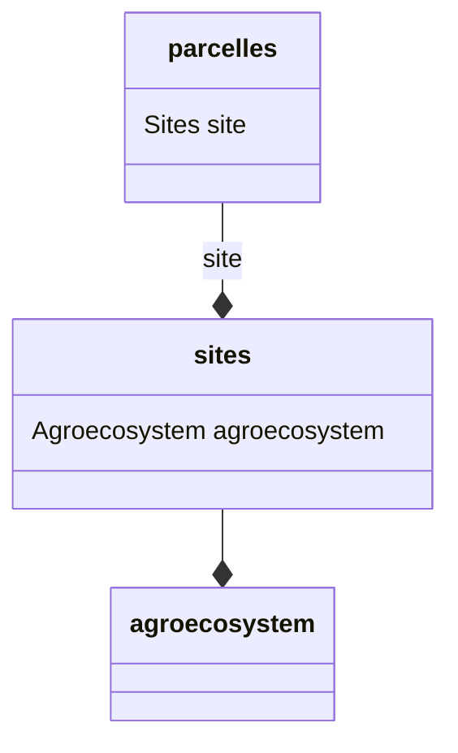

#### <a id="columns" />Description des colonnes (columns)

Pour le modèle de référentiels,



et pour les fichiers :

- __agroecosystem.csv__

| nom     | 
|---------|
| prairie |

- __sites.csv__

| Agroécosystème | nom du site |
|---------------| ------ |
| prairie       | site1 |
| prairie       | site2 |

- __parcelles.csv__

| nom du site | nom de la parcelle |
|-------------| ------ |
| site1       | 1 |
| site2       | 1 |

on aura le yaml suivant

``` yaml
references:
  agroecosystem:
  #donnée de référence avec une clef sur une colonne
    keyColumns: [nom]
    columns:
      nom:
    nom
  sites:
  #donnée de référence avec une clef sur une colonne
    keyColumns: [site]
    columns:
      agroecosystem:
        headerName: Agroécosystème
      site:
        headerName: nom du site
  parcelles:
  #donnée de référence avec une clef sur deux colonnes
    keyColumns: [site,nom de la parcelle]
    columns:
      site:
        headerName: nom du site
      parcelle:
        headerName: nom de la parcelle
```

>  La clef du référentiel est soumise à des restrictions. Voir la déclaration des [*dentificateurs*](#identificateur)
> 
> Si vous souhaitez toutefois avoir un nom plus explicite, utilisez la section internationalizationName
> 
> ``` yaml
> references:
>   mon_nom_de_referentiel:
>       internationalizationName:
>           fr: Mon nom de référentiel
>           en: The reference name
```

>  Il en est de même pour les clefs des colonnes [(cf. *Identificateurs*)](#identificateur). De plus dans les vues, le nom de la colonne peut être 
> utilisé en concaténation avec d'autres mots. Postgresql contraint ces noms à ne pas dépasser 63 caractères.
> 
> Préférez des noms courts. Si ces nom ne correspondent pas à celui de l'en-tête de votre fichier, préciser le nom de 
> l'en-tête dans le champ "headerName"
> 
> exemple: 
> ``` yaml
>       parcelle:
>         headerName: nom de la parcelle
> ```


Pensez à mettre le même nom de colonnes dans le fichier *.csv* que dans la partie *columns* du fichier yaml.

>  <span style="color: orange">*references* n'est pas indenté. *sites* et *parcelles* sont indentés de 1. *keyColumns* et
*columns* sont indentés de 2. Le contenu de *columns* seront indenté de 3.</span>

On peut rendre une colonne facultative en rajoutant dans la description de la colonne l'information :
```yaml
references:
  mareference:
    columns:
      maColonneFacultative:
        presenceConstraint: OPTIONAL
```

La valeur par défaut est :
```yaml
        presenceConstraint: MANDATORY
```

