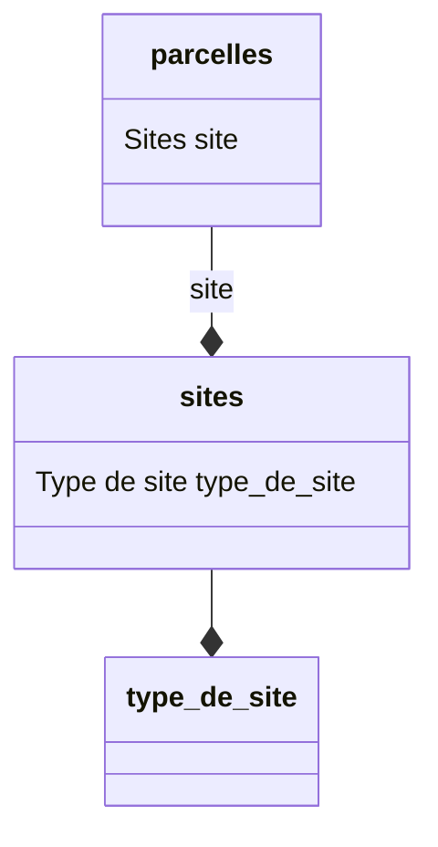

#### <a id="basicComponents" />Description des colonnes (OA_basicComponents)

Pour le modèle de référentiels,



et pour les fichiers :

- __type_de_site.csv__

| nom            | 
|----------------|
| bassin_versant |

- __sites.csv__

| nom_type_de_site | nom du site |
|------------------|-------------|
| bassin_versant   | site1       |
| bassin_versant   | site2       |

- __parcelles.csv__

| nom du site | nom de la parcelle |
|-------------|--------------------|
| site1       | 1                  |
| site2       | 1                  |

on aura le yaml suivant

```yaml
OA_data:
  tr_type_de_site_tds:
    OA_dataHeaderLine: 1
    OA_dataFirstLine: 2
    OA_naturalKey:
      - tds_nom
    OA_basicComponents:
      tds_nom: 
        OA_importHeader: nom
  tr_sites_sit:
    OA_dataHeaderLine: 1
    OA_dataFirstLine: 2
    OA_naturalKey:
      - sit_nom_type_de_site
      - sit_nom_du_site
    OA_basicComponents: 
      sit_nom_type_de_site: 
        OA_importHeader: nom_type_de_site
      sit_nom_du_site:  
        OA_importHeader: nom du site
  tr_parcelles_par:
    OA_dataHeaderLine: 1 
    OA_dataFirstLine: 2
    OA_naturalKey:
      - par_nom_de_la_parcelle
      - par_nom_du_site
    OA_basicComponents: 
      par_nom_de_la_parcelle:
        OA_importHeader: nom de la parcelle 
      par_nom_du_site: 
        OA_importHeader: nom du site
```

>  La clef du data est soumise à des restrictions. Voir la déclaration des [*identificateurs*](#identificateur)
> 
> Si vous souhaitez toutefois avoir un nom plus explicite, utilisez la section OA_i18n
> 
> exemple: 
> ``` yaml
> OA_data:
>    tr_type_de_site_tds:
>       OA_i18n:
>           fr: Type de site
>           en: Site type
> ```

>  Il en est de même pour les clefs des components [(cf. *Identificateurs*)](#identificateur). 
> De plus dans les vues, le nom de la component peut être utilisé en concaténation avec d'autres mots. 
> Postgresql contraint ces noms à ne pas dépasser 63 caractères.
> 
> Préférez des noms courts. Si ces nom ne correspondent pas à celui de l'en-tête de votre fichier, préciser le nom de 
> l'en-tête dans le champ "OA_importHeader"
> 
> exemple: 
> ``` yaml
>       parcelle:
>         OA_importHeader: nom de la parcelle
> ```

>  <span style="color: orange">*OA_data* n'est pas indenté. 
> *tr_type_de_site_tds*, *tr_sites_sit* et *tr_parcelles_par* sont indentés de 1. 
> *OA_dataHeaderLine*, *OA_dataFirstLine*, *OA_naturalKey* et *OA_basicComponents* sont indentés de 2. 
> Le contenu de *OA_basicComponents* seront indenté de 3.</span>

##### Component obligatoire
La notion de component obligaotoire est à placer au niveau de la définition du composant (pas besoin de déclarer un vérificateur)

```yaml
    sit_nom_du_site:
        OA_mandatory: true # default false sauf si le component (colonne) est déclaré dans OA_naturalKey. 
      #Dans ce cas elle passe a true par default.
```

##### Valeur obligatoire

La notion de valeur obligaotoire est à placer au niveau de la définition du composant (pas besoin de déclarer un vérificateur)
```yaml
    sit_nom_du_site:
        OA_required: true # default false sauf si le component (colonne) est déclaré dans OA_naturalKey. 
      #Dans ce cas elle passe a true par default.
```
