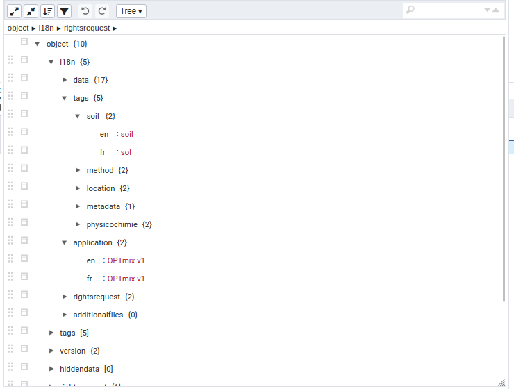
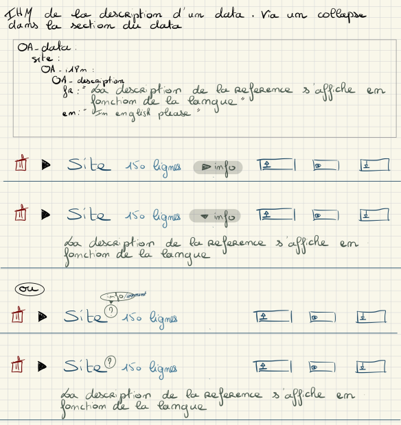
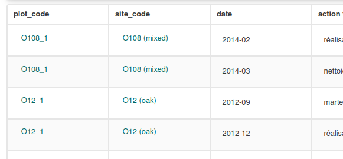

# **Affichage internationalisé dans OpenADOM**

## 1. Internationalisation dans le moteur OpenADOM

Certains élements affichés dans l'ihm sont traduits "en dur" directement dans le moteur OpenADOM. Ces élements sont à inventorier et documenter.

## 2. Internationalisation dans le fichier de configuration d'un SI

Afin de fournir des informations dans différentes langues, plusieurs traductions peuvent être définies dans le fichier de configuration. Elles peuvent correspondre à divers élements :
* des élements indépendants des différents référentiels et types des données du SI
* des éléments dépendants des différents référentiels et types des données du SI, de la structure du modèle de données mais aussi des valeurs des données.

Il est possible de voir tout ce qui est ainsi internationalisable et internationalisé pour un SI dans la base de données. Le champ `configuration` de la table `application` du schéma `public` contient des données au format json dont le noeud i18n liste les éléments internationalisables et leur internationalisation déclarée dans le yaml d'un SI.

Exemple de requête pour afficher ce champ du SI nommé "OPTmix" :

````sql
SELECT configuration FROM public.application
WHERE name='optmix1'
````

Illustration du contenu du fichier configuration pour le noeud i18n :



### 2.1. éléments indépendants des référentiels et types de données d'un SI

Certains éléments indépendants des référentiels et des types de données peuvent être concernés par un titre et ou une description qui peuvent être internationalisés.

**le titre de l'application et sa description**

````yaml
OA_version: 2.0.1 #obligatoire, version de l'application OpenADOM
OA_application: #obligatoire
  OA_name: optmix1 #obligatoire, nom du schéma
  OA_comment : "commentaire du développeur pour lui même" #optionnel affiché après la validation, à l'usage exclusif d'un applicationManager.
  OA_defaultLanguage: fr
  OA_i18n: # internationalisation du titre et de la description de l'application (du SI)
    OA_title:
      fr: "Système d'information du dispositif OPTmix - version 1.0.2"
      en: "Information system of OPTmix platform - version 1.0.2"
    OA_description:
      fr: "Ce système d'information est dédié à la gestion des données du dispositif OPTmix. Il permet également d'effectuer des visualisations et extractions de données."
      en: "This information system is dedicated to OPTmix data management. It can also be used to visualize and extract data."
  OA_version: 1.0.2 #obligatoire, version de l'application créée avec OpenADOM
````

**les tags**

````yaml
OA_tags:
  metadata: #identificateur du tag
    en: "metadata"
    fr: "métadonnées"
  location:
    en : "location"
    fr: "localisation"
  method:
    en: "methodology"
    fr: "méthodologie"
````

**les formulaires des fichiers additionnels**

Cette fonctionalité n'est pas encore implémentée, à revoir si besoin lorsque le dev démarrera.
Un titre et une description sont possibles d'une part pour le formulaire lui même et d'autre part pour chaque champ qui le compose.

````yaml
OA_additionalFiles:
  site_info: # identificateur du formulaire de fichier additionnel
    OA_i18n:
      OA_title: # titre du formulaire
        fr: "Information relatives aux sites"
        en: "Site informations"
      OA_description: # description du formulaire
        fr: "Ces fichiers additionnels sont dédiés à la description des sites pour compléter les informations déjà fournies dans la base de données."
        en: "These additional files are dedicated to site descriptions, to complement the information already provided in the database."
    OA_formFields:
      site: # construira une liste déroulante contenant les différents sites enregistrés dans le référentiel des sites.
        OA_i18n:
          OA_title: # titre de ce champ du formulaire
            fr: "Choisir un site"
            en: "Select a site"
          OA_description: # description de ce champ du formulaire
            fr: "Choisissez le site parmi la liste des sites existants pour lequel vous souhaitez ajouter ce fichier d'informations additionelles"
            en: "Choose the site from the list of existing sites for which you wish to add this additional information file"
        OA_required: true
        OA_checker:
          OA_name: OA_reference
          OA_params:
            OA_reference:
              OA_name: sites
````


**le formulaire de demande droits**

Cette fonctionalité n'est pas encore implémentée, à revoir si besoin lorsque le dev démarrera.
Un titre et une description sont possibles d'une part pour le formulaire lui même et d'autre part pour chaque champ qui le compose.


````yaml
OA_rightsRequest:
  OA_i18n:
    OA_title:
      fr: "Formulaire de demande d’accès à des données non publiques"
      en: "Request form for access to non-public data"
    OA_description:
      fr: "Si vous êtes intéressé par des données non publiques, vous pouvez remplir ce formulaire afin de demandes des accès. Le gestionnaire sera averti par mail. Veuillez à bien compléter les champs pour faciliter le traitement de votre demande."
      en: "If you are interested in non-public data, please fill in this form to request access. The administrator will be notified by e-mail. Please complete all fields to facilitate the processing of your request."
  OA_formFields:
    organization: # champ texte du formulaire
      OA_i18n:
        OA_title: # titre de ce champ du formulaire
          fr: "Nom de votre organisation"
          en: "Name of your organization"
      OA_required: false
      OA_checker:
        OA_name: OA_reference
        OA_params:
          OA_reference:
            OA_name: sites
 ````


### 2.2. éléments dépendants des référentiels et types de données d'un SI

#### 2.2.1 stratégie de dépôt/versionnement

**sans versionnement**

Il n'y a pas dinternationalisation dans le fichier de configuration. Dans ce cas, seul un bouton, éventuellement avec un texte générique (pour tous les SI) existent. L'internationalisation du texte est en dur, en dehors du fichier de configuration.

**avec versionnement**

Il n'y a pas nécessité de définir un titre et une description  àcette fonctionnalité. Le message peut être générique pour tous les SI et internationalisable (ex:"Veuillez sélectionner les éléments attendus pour identifier le jeu de données correspondant à votre fichier et afficher les éventuelles différentes versions existantes")

En revanche, quand il n'y a pas de file pattern et que les éléments identifiant ce que l'on a appelé un "jeu de données" dans la documentation dédiée à cette question peuvent bénéficier d'un titre et d'une description personalisée et internatonalisée dans le fichier de configuration. A noter que les sections OA_exportHeader optionelles dans cette section sont identiques à celles présentées plus haut et peuvent donc aussi contenir un titre et une description internationalisés.

```yaml

    OA_submission:
      OA_strategy: OA_VERSIONING
      OA_submissionScope:
        OA_referenceScopes:
          - OA_component: projet
            OA_reference: projet
            OA_i18n:
              OA_title:
                fr: "projet"
                en: "project"
              OA_description:
                fr: "Choisir un projet..."
                en: "Choose a project..."
            OA_exportHeader: #si doit être stocké en base
              OA_title:
                fr: "projet"
                en: "project"
              OA_description:
                fr: "Nom codique du projet"
                en: "Project code name"
          - OA_component: chemin
            OA_reference: sites
            OA_i18n:
              OA_title:
                fr: "site"
                en: "site"
              OA_description:
                fr: "Choisir un site..."
                en: "Choose a site..."            
            OA_exportHeader:
              OA_title:
                fr: "site"
                en: "site"
              OA_description:
                fr: "Nom codique du site"
                en: "Site code name"
        OA_timeScope:
          OA_component: date
````

#### 2.2.2 éléments décrivant la structure du modèle de données

Certains éléments décrivant la structure du modèle de données dans le fichier de configuration peuvent être traduits tels que  les types de données et leurs composants.

Le nom d'une donnée au sens large, référentiel (`__REFERENCE__`) ou autre (`__DATA__`), correspond implicitement à son identificateur dans le yaml. C'est par défaut cet identificateur qui est utilisé dans l'interface là où le référentiel est nommé.  Cet identificateur devrait suivre la convention de nommage définie pour OpenADOM (ex : `tr_variable_var`). Cette convention n'est pas forcément ce que l'on veut voir dans l'ihm, car peu explicite pour l'utilisateur final. Une internationalisation est donc possible avec *OA\_i18n* pour à la fois un titre et une description comme suit:

```yaml
OA_data:
   tr_mode_peche_mpe:
      OA_tags: [ référence, espèces ]
      OA_i18n:
        OA_title:
          fr: "Mode de pêche"
          en: "Fishing mode"
        OA_description:
          fr: "Mode de pêche (casier, filet, hameçon, ...)"
          en: "Fishing method (trap, net, hook, etc.)"
 ``` 

Dans l'IHM, le titre d'un référentiel ou d'un type de données est affiché d'emblée. Sa description est affichée au clic sous le titre sur un lien "voir descrition"/"see description" ou un icône correspondant.
Voici une maquette d'un exemple de rendu attendu [METTRE A JOUR la copie d'écran quand développé et déployé]:




Les noms des composants définis pour les données peuvent être fournis dans l'affichage et l'extraction dans plusieurs langues _via_ la section `OA_exportHeader`. Cela correspond aux en-têtes de colonnes en sortie. Tous les types de composants sont concernés :
* OA_basicComponents
* OA_computedComponents
* OA_constantComponents
* OA_dynamicComponents **(à vérifier)**
* OA_patternComponents

Afin de reprendre les sections OA_title et OA_description déjà utilisée par d'autres élements, celles-ci sont utilisables pour les composants. Néanmoins la déclaration OA_exportHeader n'est pas suivie de OA_i18n ; OA_exportHeader est considéré comme équivalent à une section OA_i18n dans le code java, comme illustré ci-dessous :

```yaml
    OA_basicComponents:
      tel_hour:
        OA_importHeader: "Heure"
        OA_exportHeader: #équivalement à OA_i18n mais déclaré OA_exportHeader plutôt que OA_i18n (même fonctionnement dans le cede java)
          OA_title:
            fr: "Heure"
            en: "Hour"
          OA_description:
            fr: "Heure de prise de la mesure"
            en: "Hour of data acquisition"  
    OA_constantComponents:
      tel_site:
        OA_exportHeader:
          OA_title:
            fr: "plateforme"
            en: "platform"
          OA_description:
            fr: "Nom codique de la plateforme"
            en: "Codename of the platform"
        OA_importHeaderTarget:
          OA_rowNumber: 2
          OA_columnNumber: 2
    OA_computedComponents:
      tel_pixel_count:
        OA_computation:
          OA_expression: >
            return datum.tel_pixel_count_10m;
        OA_exportHeader:
          OA_title:
            fr: "nombre de pixels"
            en: "pixel count"
          OA_description:
            fr: "nombre de pixels retenus pour la zone à la résolution utilisée"
            en: "number of pixels selected for the area at the resolution used"
    OA_patternComponents:
      tel_value:
        OA_patternForComponents: "(.*)"
        OA_exportHeader:
          OA_title:
            fr: "valeur"
            en: "value"
          OA_description:
            fr: "valeur de la variable"
            en: "value of the variable"
        OA_componentQualifiers:   # OA_componentQualifiers correspond à un cas spécifique où on capture des qualificatifs de la variable, mais on peut très bien utilisé cette section pour capturer le nom de la variable (ex ici avec (.*)). Je propose OA_matchingComponents ou OA_tokenToComponents pour être plus générique
          - tel_variable:
              OA_exportHeader:
                OA_title:
                  fr: "index de télédétection"
                  en: "remote sensing index"
                # OA_description:  optionnel

```

#### 2.2.3 l'internationalisation de valeurs de données de référentiels et types de données

Cette section couvre deux besoins:

**1. l'affichage/extraction des valeurs de certains composants selon la langue déterminée pour l'ihm**

Si la langue demandée pour l'ihm est le français par exemple, on peut souhaiter pour une information donnée restreindre l'affichage/l'extraction aux valeurs d'un composant associé à cette langue.
Par exemple si on a deux colonnes dans le fichier csv, l'une contenant la description d'un site en français et l'autre la description en anglais, on souhaite que ce soit la bonne colonne qui soit utilisée pour l'affichage et l'export selon la langue demandée dans l'ihm.
Pour cela, on utilise la section `OA_langRestrictions` dans la déclaration des composants ; elle contient une liste des codes des langues pour lesquels les valeurs du component concerné sont à afficher/extraire.

Exemple dans cet extrait d'un yaml :

````yaml
    OA_basicComponents:
      pty_code:
        OA_importHeader: plot_type_code
        OA_required: true  #optional
        OA_tags: [__ORDER_1__]
      pty_label_fr:
        OA_importHeader: plot_type_label_fr
        OA_tags: [__ORDER_2__]
        OA_exportHeader:
          OA_title:
            fr: "libellé"
            en: "label"
        OA_langRestrictions: [fr,it]
      pty_label_en:
        OA_importHeader: plot_type_label_en
        OA_tags: [__ORDER_3__]
        OA_exportHeader:
          OA_title:
            fr: "libellé"
            en: "label" 
        OA_langRestrictions: [en,es]
````

Attention, cette option d'affichage/extraction est réservée aux cas suivants :
* pour les référentiels fournis lors de l'extraction de données `\__DATA___`
* pour la recherche et l'extraction en mode expert (approfondie)

Lors de l'affichage ou l'extraction de données de référentiel directement, la section `OA_langRestrictions` ne s'applique pas, tous les composants sont restitués.

**2. la surcharge et l'internationalisation des valeurs d'une clé naturelle**

Lorsqu'un affichage de données, référentiels ou data, ou une extraction contient une ou plusieurs colonnes faisant référence à des colonnes d'autres données (référentiels ou données expérimentales), c'est la valeur de la clé naturelle qui est est fournie par défaut (faisant office de clé étangère). La clé naturelle n'est pas dans tous les cas explicite pour les utilisateurs finaux et on peut surcharger son affichage et l'internationaliser avec l'emploi d'une section `OA_i18nDisplayPattern` dans la section `OA_naturalKey` comme dans l'exemple ci-dessous. Le titre correspond à la valeur qui sera affichée. Ce titre est cliquable dans l'ihm et ouvre une modale affichant le détail de la ligne correspondante dans le référentiel. La description sera elle affichée au survol par le curseur de la valeur affichée (le titre ici). Chaque pattern de surcharge doit être obligatoirement encadré par des quotes (doubles ou simple).

````yaml
  tr_site_sit: #site.csv (= dispositif dans OPTmix)
    OA_i18n:
      OA_title:
        fr: "Liste des sites"
        en: "List of sites"
      OA_description:
        fr: "Liste des sites d'OPTmix et leurs caractéristiques principales"
        en: "List of OPTmix sites and their main characteristics" 
    OA_tags: 
      - __REFERENCE__
      - location
    OA_naturalKey: # ATTENTION, nouvelle écriture décidée à Thonon juin 2024
      OA_component: 
        - sit_code
      OA_i18nDisplayPattern:
        OA_title:
          fr: "{sit_code} ({sit_label_fr})" # {sit_code} sera remplacé par les valeur du composant sit_code et {sit_label_fr} par les valeurs du composant sit_label_fr. Ex: O108 (mélange). Encadrement obligatoire par des quotes.
          en: "{sit_code} ({sit_label_en})" # ex: O108 (mixed). Encadrement obligatoire par des quotes.
        OA_description:
          fr: "{sit_description_fr}" # Encadrement obligatoire par des quotes.
          en: "{sit_description_en}" # Encadrement obligatoire par des quotes.
    OA_basicComponents:
      sit_code:
        OA_importHeader: "site_code"
        OA_required: true
        OA_tags: [__ORDER_1__]
      sit_label_fr:
        OA_importHeader: "site_label_fr"
        OA_tags: [__ORDER_2__]
        OA_langRestrictions: [fr] #sans effet sur OA_i18nDisplayPattern
      sit_label_en:
        OA_importHeader: "site_label_en"
        OA_tags: [__ORDER_3__]
        OA_langRestrictions: [en] #sans effet sur OA_i18nDisplayPattern

````

Dans la section `OA_i18nDisplayPattern`, on attend pour chaque langue un pattern d'affichage. il peut contenir une référence à un ou plusieurs composant du référentiel ou type de données en cours. Chaque composant est entouré par des accolades. Des caractères libres peuvent être inclus.
Chaque composant d'un référentiel ou d'un type de données qui est lié au référentiel ou au type de données faisant l'objet d'une surcharge de sa clé naturelle affichera et exportera les valeurs résultantes du pattern de la langue demandée. Les éventuelles sections `OA_langRestrictions` des composants intégrés aux patterns sont sans effect sur ces valeurs résultantes des paterns.

Pour illustrer le résultat de l'utilisation de la surcharge de la clé naturelle du referentiel `tr_site_sit` dans le yaml ci-dessus, voici un extrait de yaml d'un type de données dont le component `plom_sit_code` fait référence à `tr_site_sit`

````yaml
  t_plot_management_plom: #travaux.csv
    OA_i18n:
      OA_title:
        fr: "Travaux effectués sur les parcelles expérimentales"
        en: "Management actions carried out on the experimental plots"
    OA_tags: 
      - location
      - method
      - __DATA__
    OA_naturalKey:
      OA_components:
        - plom_plo_code
        - plom_sit_code
        - plom_date
    OA_basicComponents:
      plom_plo_code:
        OA_importHeader: "plot_code"
        OA_tags: [__ORDER_1__]
        OA_required: true
        OA_checker:
          OA_name: OA_reference
          OA_params:
            OA_reference:
              OA_name: tr_plot_plo
      plom_sit_code:
        OA_importHeader: "site_code"
        OA_tags: [__ORDER_2__]
        OA_required: true
        OA_checker:
          OA_name: OA_reference
          OA_params:
            OA_reference:
              OA_name: tr_site_sit # référence au référentiel des sites de l'extrait de yaml précédent et contenant une surcharge de la clé naturelle
````

Aperçu du résultat pour l'affichage et l'extraction des données des travaux :



**Note:** la surcharge de la clé naturelle d'un référentiel ou d'un type de données n'est pas appliquée pour l'affichage ou l'extraction directe du dit référentiel ou type de données. C'est bien la valeur de la clé naturelle non surchargée qui est alors fournie.

**3. Résolution de la langue à afficher dans l'ihm.**

On distingue dans l'ordre:

1. la demande de l'internaute :
    - résulte de la langue du navigateur et de la demande de la langue souhaitée dans l'IHM d'OpenADOM (bandeau supérieur)
    - la langue sélectionnée par l'utilisateur dans l'IHM est prioritaire
2. la langue par défaut dans le fichier de configuration du SI : valeur pour `OA_defaultLanguage`
3. l'internationalisation de l'identificateur d'éléments (identificateurs de l'application, de data, de component) dans le fichier de configuration du SI : valeur(s) pour OA_i18n
4. l'internationalisation de la surcharge des valeurs de clés naturelles : `OA_i18nDisplayPattern`

Le tableau suivant résume la matrice utilisée pour la gestion des différents cas :

| demande internaute | OA_defaultLanguage | OA_i18n                                 | OA_i18nDisplayPattern |
|:--------------------:|:--------------------:|-----------------------------------------|-----------------------|
|en|en| fr en -> en <br>fr NA -> identificateur<br>NA en -> en<br>ND ND -> identificateur |fr en -> en<br>fr NA -> naturalKey<br>NA en -> en<br>NA NA -> naturalKey|
|en|fr| fr en -> en<br>fr NA -> fr<br>NA en -> en<br>ND ND -> identificateur<br>|fr en -> en<br>fr NA -> fr<br>NA en -> en<br>NA NA -> naturalKey|