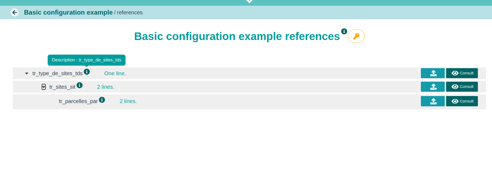
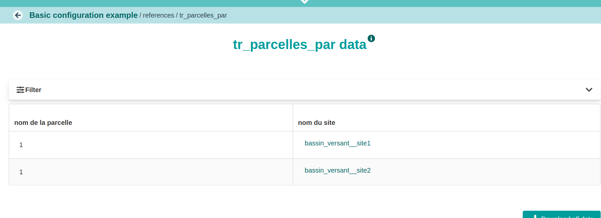
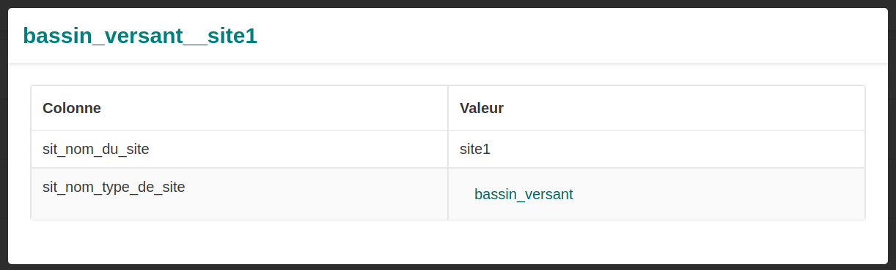

## Description

Pour l'exemple nous prenons une hiérarchie de référentiels

```{mermaid}
classDiagram
    direction LR
    tr_sites_sit *-- tr_parcelles_par:site
    tr_type_de_sites_tds  *-- tr_sites_sit:type_de_sites
    
    class tr_type_de_sites_tds:::pkClass {
        +String tds_nom PK
    }
    
    class tr_sites_sit:::fkClass {
        +String sit_nom_type_de_site PK
        +String sit_nom_du_site PK
        +tr_type_de_sites_tds type_de_sites FK
    }
    
    class tr_parcelles_par:::fkClass {
        +String par_nom_de_la_parcelle PK
        +String par_nom_du_site PK
        +tr_sites_sit site FK
    }

  style tr_type_de_sites_tds fill:#d7e4fa,stroke:#333,stroke-width:2px
  style tr_sites_sit fill:#f8d7fa,stroke:#333,stroke-width:2px
  style tr_parcelles_par fill:#f4fad7,stroke:#333,stroke-width:2px


```

::: {.callout-important collapse="false" title="Types de sites"}
```{r}
#| echo: false
#| label: tr_type_de_sites_tds.csv
#| tbl-cap: Types de sites"
#| code-fold: show
knitr::kable(read.csv("fichiers/tr_type_de_sites_tds.csv", header = TRUE,  sep = ';',  stringsAsFactors = FALSE))

```
:::

::: {.callout-important collapse="false" title="Sites"}
```{r}
#| echo: false
#| label: tr_sites_sit.csv
#| tbl-cap: Sites"
#| code-fold: show
knitr::kable(read.csv("fichiers/tr_sites_sit.csv", header = TRUE,  sep = ';',  stringsAsFactors = FALSE))

```
:::

::: {.callout-important collapse="false" title="Parcelles"}
```{r}
#| echo: false
#| label: tr_parcelle_par.csv
#| tbl-cap: "Parcelles"
#| code-fold: show
knitr::kable(read.csv("fichiers/tr_parcelles_par.csv", header = TRUE,  sep = ';',  stringsAsFactors = FALSE))

```
:::

::: {.callout-warning collapse="false" title="Clef composite"}
Dans la colonne nom du site de tr_parcelles_par, on utilise la claf composite du site au lieu de son nom. C'est parceque l'on a ajouté un checker réference sur cette colonne et que tr_sites_sit à déclaré une clef composite sur le type de site et le nom.
:::

## Configuration

On déclare les colonnes du fichier dans des composantes de la section c.

Nous avons fais le choix de déclarer les  avec une [convention de nommage](https://sqlpro.developpez.com/cours/standards/). De ce fait, les noms de colonnes ne correspondent pas. On doit donc rajouter une section  pour faire correspondre la composante avec la colonne du fichier.

::: {.callout-important collapse="false" title="dynamicComponent.yaml"}
``` yaml

```

[basicComponent.yaml](configuration.yaml)
:::

## Rendu

::: {.callout-important collapse="false" title="visualisation des référentiels"}

:::

::: {.callout-important collapse="false" title="visualisation des parcelles"}

:::

::: {.callout-important collapse="false" title="visualisation de la colonne nom du site"}

:::

## Stockage en base

### Stockage des valeurs

``` sql
select refvalues 
from basic_case.referencevalue
where referencetype = 'tr_parcelles_par' and 
naturalkey = 'bassin_versant__site1__1'::ltree
```

``` json
{
  "par_nom_du_site": "bassin_versant__site1",
  "__display_default": "bassin_versant__site1__1",
  "par_nom_de_la_parcelle": "1"
}
```

### Stockage des clefs étrangères

``` sql
select refslinkedto 
from basic_case.referencevalue
where referencetype = 'tr_parcelles_par' and 
naturalkey = 'bassin_versant__site1__1'::ltree
```

``` json
{
  "tr_sites_sit": {
    "par_nom_du_site": {
      "uuids": [
        "7e8e0b0b-75a3-4bb2-907f-07dc1da368e8"
      ],
      "hierarchicalkey": "tr_type_de_sites_tdsKbassin_versant.tr_sites_sitKbassin_versant__site1"
    }
  }
}
```

## Pour aller plus loin

On peut voir que ce qui s'affiche pour les clef étrangères, c'est le code de la clef naturelle bassin_versant\_\_site1.

On peut surcharger ce code en définissant dans tr_sites_sit une section 

``` yaml
  tr_sites_sit:
  ...
    OA_i18nDisplayPattern:  
      OA_title:   
        fr: "{sit_nom_du_site}"
        en: "{sit_nom_du_site}"
```