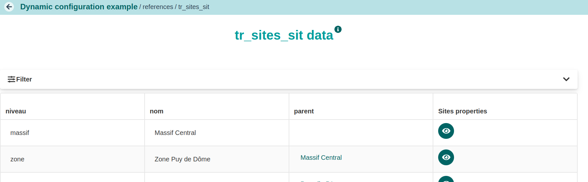
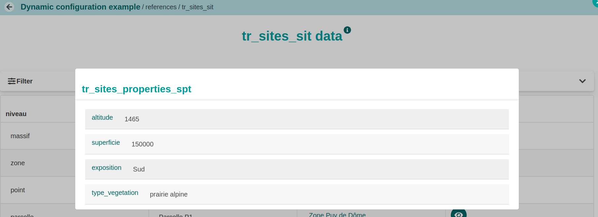

## Description

Ici les sites repésentent des zones d'études. Il en existe différents types imbriquées les une dans les autres. Pour chaque type on peut définir un certain nombre de propriétes communes à plusieurs types de zones d'étude ou spécifiques d'une zone d'étude.

::: {.callout-important collapse="false" title="Propriétés des sites"}
```{r}
#| echo: false
#| label: tr_sites_properties_spt.csv
#| tbl-cap: "Propriétés des sites"
#| code-fold: show
knitr::kable(read.csv("fichiers/tr_sites_properties_spt.csv", header = TRUE,  sep = ';',  stringsAsFactors = FALSE))

```
:::

::: {.callout-important collapse="false" title="Sites"}
```{r}
#| echo: false
#| label: tr_sites_sit.csv
#| tbl-cap: "Zones d'études"
#| code-fold: show
knitr::kable(read.csv("fichiers/tr_sites_sit.csv", header = TRUE,  sep = ';',  stringsAsFactors = FALSE))

```
:::

## Configuration

On pourra décrire le fichier de configuration en utilisant une composante property défine comme une composante dynamique.

::: {.callout-important collapse="false" title="dynamicComponent.yaml"}
``` yaml

```

[dynamicComponent.yaml](/fichiers/examples/dynamicComponant/dynamicComponent.yaml)
:::

## Rendu

::: {.callout-important collapse="false" title="visualisation des sites"}

:::

::: {.callout-important collapse="false" title="visualisation des propriétés de Zone Puy de Dôme"}
:::
:::

## Stockage en base

``` sql
select refvalues 
from dynamic_case_sites.referencevalue
where referencetype = 'tr_sites_sit' and 
naturalkey = 'zone_puy_de_dome'::ltree
```

``` json
{
  "nom": "Zone Puy de Dôme",
  "niveau": "zone",
  "parent": "massif_central",
  "property": {
    "ph_sol": "",
    "altitude": "1465",
    "type_sol": "",
    "exposition": "Sud",
    "superficie": "150000",
    "humidite_sol": "",
    "type_vegetation": "prairie alpine",
    "densite_vegetation": "",
    "temperature_moyenne": "",
    "pluviometrie_annuelle": ""
  },
  "__display_default": "Zone Puy de Dôme"
}
```