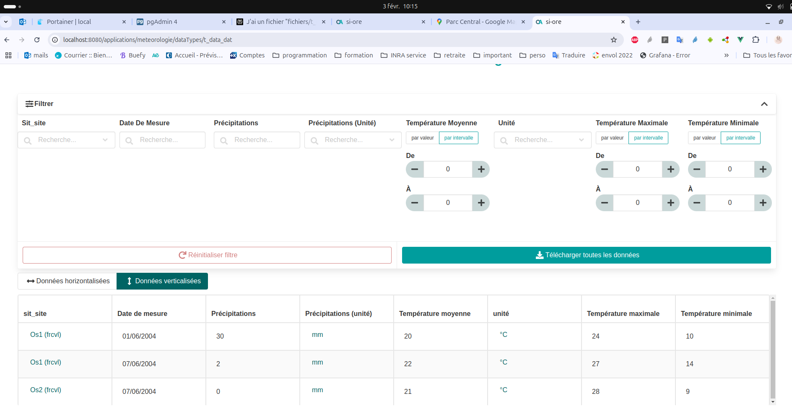
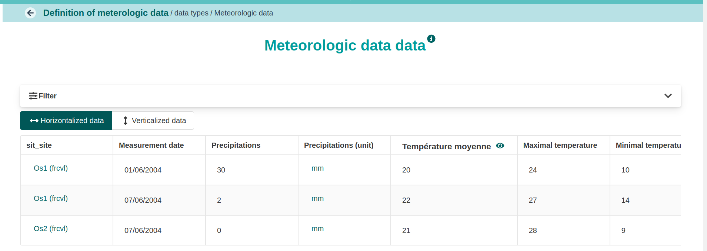
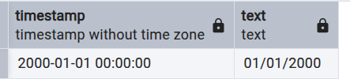

## Description

Nous avons des données de météorologie

::: {.callout-important collapse="false" title="tr_data_dat.csv"}
```{r}
#| echo: false
#| label: tr_data_dat.csv
#| code-fold: show
library(knitr)

# Lecture du fichier sans en-tête
data <- read.csv("fichiers/t_data_dat.csv", 
                 sep = ";",
                 header = FALSE,  # Important : on lit sans en-tête
                 encoding = "UTF-8")

# Remplacement des NA
data[is.na(data)] <- ""

# Affichage avec kable
kable(data,
      col.names = c(rep("", ncol(data))),  # Crée autant de colonnes vides que nécessaire
      format = "html",
      table.attr = 'style="margin-top: 0px; width: auto;"')

```
:::

### Cartouche
Ce fichier fichier possède un .

- l'en-tête est à la ligne 3
- la première ligne de données à la ligne 4

### Constantes du  fichier

Ce sont des valeurs qui s'appliquent à toutes les lignes du fichier

Dans le "pre-header" on trouve 
- une information de localisation (la région). C'est une clef étrangère vers le référentiel tr_regions_reg
- une information de temporalité (la période de mesure).

### En-tête

Ce sont les noms des colonnes
- **Date de mesure** : une information de temporalité au foramt dd/MM/yyyy correspondant un une période de 1 jour (moyenne de calcul)
- **Site**: une inforamtion de localisation qui permettra en l'associant à une région à identifier un site. C'est une clef étrangère. C'est à dire qu'on retrouvera l'information du site dans le référentiel tr_sites_sit. La combinaison région - site fera référence à une ligne de ce référentiel.
- **Précipitation** : c'est une variable (valeur flottante) que l'on mesure en mm.
- **Température** : une variable de température déclinée en trois composante et mesurée en degré Celsius.
Date de mesure;Site;Précipitation;Température moyenne;Température minimale;Température maximale

Les unités feront référence au référentiel tr_unites_uni. Elle ne sont pas présentes dans le fichier mais on peut les fournir directement dans la configuration.

### Référentiels

Il s'agit des informations permettant de comprendre les données du fichier tr_data_dat.csv

::: {.callout-important collapse="false" title="tr_regions_reg"}
```{r}
#| echo: false
#| label: tr_regions_reg.csv
#| tbl-cap: "Régions"
#| code-fold: show
knitr::kable(read.csv("fichiers/tr_regions_reg.csv", header = TRUE,  sep = ';',  stringsAsFactors = FALSE))

```
:::


::: {.callout-important collapse="false" title="tr_sites_sit"}
```{r}
#| echo: false
#| label: tr_sites_sit.csv
#| tbl-cap: "Sites"
#| code-fold: show
knitr::kable(read.csv("fichiers/tr_sites_sit.csv", header = TRUE,  sep = ';',  stringsAsFactors = FALSE))

```
:::

::: {.callout-important collapse="false" title="tr_unites_uni"}
```{r}
#| echo: false
#| label: tr_unites_uni.csv
#| tbl-cap: "Unités"
#| code-fold: show
knitr::kable(read.csv("fichiers/tr_unites_uni.csv", header = TRUE,  sep = ';',  stringsAsFactors = FALSE))

```
:::

## Configuration

### On doit d'abord décrire l'application

- déclaration de la version du moteur

::: {.callout-important collapse="false" title="OA_version"}
``` {r}
#| echo: false
yaml_content <- suppressWarnings(readLines("configuration.yaml"))
yaml_content <- yaml_content[0:1]
cat(yaml_content, sep = "\n")
```
:::

- déclaration de l'application

::: {.callout-important collapse="false" title="OA_application"}
``` {r}
#| echo: false
yaml_content <- suppressWarnings(readLines("configuration.yaml"))
yaml_content <- yaml_content[2:13]
cat(yaml_content, sep = "\n")
```
:::

### On déclare le référentiel tr_region_reg


::: {.callout-important collapse="false" title="region"}

``` {r}
#| echo: false
yaml_content <- suppressWarnings(readLines("configuration.yaml"))
yaml_content <- yaml_content[14:14]
cat(yaml_content, sep = "\n")
```

``` {r}
#| echo: false
yaml_content <- suppressWarnings(readLines("configuration.yaml"))
yaml_content <- yaml_content[15:58]
cat(yaml_content, sep = "\n")
```
...
:::

- On déclare code comme clef naturelle.
- On ajoute un  pour le code.
- On surcharge l'affichage de ce code en rajoutant la section . 
- on rajoute des **OA_exportHeader** pour l'affichage des en-tête à l'extraction
- On rajoute des  __ORDER_ pour ordonner les types de données et les composantes à l'extraction.

### On déclare le référentiel tr_sites_sit

::: {.callout-important collapse="false" title="Site"}
``` {r}
#| echo: false
yaml_content <- suppressWarnings(readLines("configuration.yaml"))
yaml_content <- yaml_content[14:14]
cat(yaml_content, sep = "\n")
```
...
``` {r}
#| echo: false
yaml_content <- suppressWarnings(readLines("configuration.yaml"))
yaml_content <- yaml_content[59:119]
cat(yaml_content, sep = "\n")
```
...
:::

- On déclare une clef composite pour sites (sit_nom, reg_code)
- On surcharge l'affichage de ce code en rajoutant la section . 
- On rajoute un  de type date sur sit_date.
- On rajoute un  de type clef étrangère pour la composante région. De plus on ajoute : true pour indiquer que tr_regions_reg est le parent de tr_sites_sit.
- on rajoute des **OA_exportHeader** pour l'affichage des en-tête à l'extraction
- On rajoute des  __ORDER_ pour ordonner les types de données et les composantes à l'extraction.


### On déclare le référentiel tr_unites_uni

::: {.callout-important collapse="false" title="Unité"}
``` {r}
#| echo: false
yaml_content <- suppressWarnings(readLines("configuration.yaml"))
yaml_content <- yaml_content[14:14]
cat(yaml_content, sep = "\n")
```
...
``` {r}
#| echo: false
yaml_content <- suppressWarnings(readLines("configuration.yaml"))
yaml_content <- yaml_content[120:167]
cat(yaml_content, sep = "\n")
```
...
:::

- On déclare une clef naturelle uni_nom
- On surcharge l'affichage de ce code en rajoutant la section . 
- on rajoute des **OA_exportHeader** pour l'affichage des en-tête à l'extraction
- On rajoute des  __ORDER_ pour ordonner les types de données et les composantes à l'extraction.
- Pour internationnaliser l'affichage de la colonne nom on utilise un  __HIDDEN__ et une section **OA_langRestrictions**

### Déclaration de la donnée t_data_dat


::: {.callout-important collapse="false" title="Météorologie"}
``` {r}
#| echo: false
yaml_content <- suppressWarnings(readLines("configuration.yaml"))
yaml_content <- yaml_content[14:14]
cat(yaml_content, sep = "\n")
```
...
``` {r}
#| echo: false
yaml_content <- suppressWarnings(readLines("configuration.yaml"))
yaml_content <- yaml_content[168:309]
cat(yaml_content, sep = "\n")
```
:::


- On déclare une clef composite pour data (sit_site, dat_date)
- On rajoute un  de type date sur dat_date, dat_periode.
- On rajoute un  de type clef étrangère pour les composantes sit_site, reg_region, dat_precipitation_unit et dat_unit.
- On rajoute un  de type valeur flottante pour les composantes dat_precipitation, dat_temperature_moyenne, dat_temperature_minimale, dat_temperature_maximale.
- on rajoute des **OA_exportHeader** pour l'affichage des en-tête à l'extraction
- On rajoute des  __DATA__ sur le type t_data_dat pour indiquer qu'il s'agit de données et __ORDER_ pour ordonner les types de données et les composantes à l'extraction.

Pour récupérer le site qui est une clef composite sur le nom du site et le code de la région:
- on récupère d'abord le code de la région comme une constante de ficher dans une section  avec une  __HIDDEN__ pour ne pas l'afficher en sortie.

::: {.callout-important collapse="false" title="constant component: reg_region"}

``` {r}
#| echo: false
yaml_content <- suppressWarnings(readLines("configuration.yaml"))
yaml_content <- yaml_content[204:215]
cat(yaml_content, sep = "\n")
```
:::
- on récupère le nom du site comme composante basique dans une section  avec une  __HIDDEN__ pour ne pas l'afficher en sortie.


::: {.callout-important collapse="false" title="basic component : sit_nom"}

``` {r}
#| echo: false
yaml_content <- suppressWarnings(readLines("configuration.yaml"))
yaml_content <- yaml_content[182:182]
cat(yaml_content, sep = "\n")
```
``` {r}
#| echo: false
yaml_content <- suppressWarnings(readLines("configuration.yaml"))
yaml_content <- yaml_content[193:196]
cat(yaml_content, sep = "\n")
```
:::

- On calcule la clef composite comme composante calculée dans une section 

::: {.callout-important collapse="false" title="computed component: sit_site"}

``` {r}
#| echo: false
yaml_content <- suppressWarnings(readLines("configuration.yaml"))
yaml_content <- yaml_content[228:237]
cat(yaml_content, sep = "\n")
```
:::

**OA_withNaturalKeyComponents** permet de construire la clef naturelle qui sera validée par le vérificateur.

Pour les variables et leurs unités nous utilisons deux stratégies:

- Pour les précipitation la valeur est récupéré comme une composante basique  et l'unité comme une composante calculée 

- Pour les températures nous décrivons une composante pattern:

  - OA_patternForComponents donne un pattern qui capture la colonne Température moyenne. 
  
::: {.callout-important collapse="false" title="computed component: sit_site"}

``` {r}
#| echo: false
yaml_content <- suppressWarnings(readLines("configuration.yaml"))
yaml_content <- yaml_content[252:268]
cat(yaml_content, sep = "\n")
```
:::

  - Le seul groupe de capture de l'expression est le nom de l'unité -> c'est un qualifiant du pattern

::: {.callout-important collapse="false" title="computed component: sit_site"}

``` {r}
#| echo: false
yaml_content <- suppressWarnings(readLines("configuration.yaml"))
yaml_content <- yaml_content[269:280]
cat(yaml_content, sep = "\n")
```
:::
  - les autres colonnes température sont capturées comme colonne adjacente.

::: {.callout-important collapse="false" title="computed component: sit_site"}

``` {r}
#| echo: false
yaml_content <- suppressWarnings(readLines("configuration.yaml"))
yaml_content <- yaml_content[281:309]
cat(yaml_content, sep = "\n")
```
:::

## Rendu

::: {.callout-important collapse="false" title="visualisation de la météorologie"}

:::

::: {.callout-important collapse="false" title="visualisation de la météorologie"}

:::


## Stockage en base

### tr_sites_sit

``` sql
select  refvalues 
from meteorologie.referencevalue
where referencetype = 'tr_sites_sit' and 
naturalkey = 'frcvl__os1'::ltree
```

``` json
{
  "sit_nom": "Os1",
  "reg_code": "frcvl",
  "sit_date": "date:2000-01-01T00:00:00:dd/MM/yyyy",
  "__display_en": "Os1 (frcvl)",
  "__display_fr": "Os1 (frcvl)",
  "__display_default": "Nom du site: Os1; Nom de la région: (frcvl)",
  "__display_description_en": "Site name: Os1; région name (frcvl)",
  "__display_description_fr": "Nom du site: Os1; Nom de la région: (frcvl)"
}
```
On remarquera la surcharge de la clef naturelle __display_...

On peut récupérer la date

``` sql
select  
  ((refvalues #>> '{sit_date}')::composite_date)::timestamp, 
  ((refvalues #>> '{sit_date}')::composite_date)::text 
from meteorologie.referencevalue
where referencetype = 'tr_sites_sit' and 
naturalkey = 'frcvl__os1'::ltree
```

::: {.callout-important collapse="false" title="visualisation de la météorologie"}

:::


### t_data_dat

``` sql
select  refvalues 
from meteorologie.referencevalue
where referencetype = 't_data_dat' and 
naturalkey = 'frcvl__os1__01SOLIDUS06SOLIDUS2004'::ltree
```

``` json
{
  "sit_nom": "Os1",
  "dat_date": "01/06/2004",
  "sit_site": "frcvl__os1",
  "reg_region": "frcvl",
  "dat_periode": "date:1970-01-01T00:00:00:MM/yyyy",
  "__display_default": "frcvl__os1__01/06/2004",
  "dat_precipitation": "30",
  "dat_precipitation_unit": "precipitation",
  "dat_temperature_moyenne": {
    "dat_unit": "temperature",
    "__VALUE__": 20,
    "__COLUMN_NAME__": "dat_temperature_moyenne",
    "__ORIGINAL_COLUMN_NAME__": "Température moyenne",
    "dat_temperature_maximale": 24,
    "dat_temperature_minimale": 10
  }
}

```

On remarque la différence de stratégie de récupération des valeurs précipitation et température : 

- il n'y a pas de marquage de la proximité des variables dat_precipitation et dat_precipitation_unit
- toutes les valeurs correspondant à la température sont regroupées dans un même objet json sous le label dat_temperature_moyenne qui est l'idendificateur du patternComponent

```