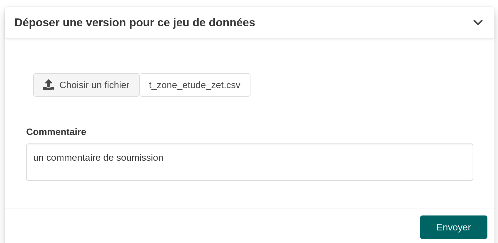
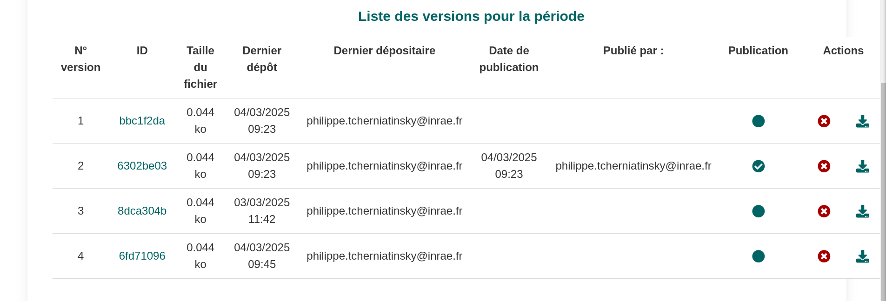

## Description

Nous avons des données de zone d'étude

::: {.callout-important collapse="false" title="tr_data_dat.csv"}
```{r}
#| echo: false
#| label: t_zone_etude_zet.csv
#| code-fold: show
library(knitr)

# Lecture du fichier sans en-tête
data <- read.csv("fichiers/t_zone_etude_zet.csv",
                 sep = ";",
                 header = FALSE,  
                 encoding = "UTF-8")

# Remplacement des NA
data[is.na(data)] <- ""

# Affichage avec kable
kable(data,
      col.names = c(rep("", ncol(data))),  # Crée autant de colonnes vides que nécessaire
      format = "html",
      table.attr = 'style="margin-top: 0px; width: auto;"')

```
:::

## Configuration

On décrit ici un type de données t_zone_etude_zet.

On rajoute une section {{\<var page-refs.submission.oa\>}}

::: {.callout-important collapse="false" title="OA_submission"}
```{r}
#| echo: false
yaml_content <- suppressWarnings(readLines("submissionWithoutScope.yaml"))
yaml_content <- yaml_content[12:13]
cat(yaml_content, sep = "\n")
```

...

```{r}
#| echo: false
yaml_content <- suppressWarnings(readLines("submissionWithoutScope.yaml"))
yaml_content <- yaml_content[37:39]
cat(yaml_content, sep = "\n")
```
:::

## rendu





