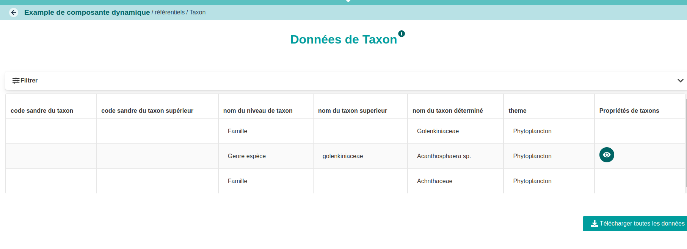
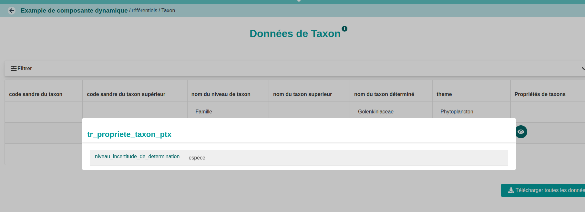

## Description

Ici les taxons repésentent des déterminations. Il en existe différents types imbriqués les uns dans les autres. Pour chaque type on peut définir un certain nombre de propriétes communes à plusieurs taxons ou spécifiques d'un taxon.

::: {.callout-important collapse="false" title="Propriétés des taxons"}
```{r}
#| echo: false
#| label: tr_sites_properties_spt.csv
#| tbl-cap: "Propriétés des sites"
#| code-fold: show
knitr::kable(read.csv("fichiers/tr_taxon_properties_tpt.csv", header = TRUE,  sep = ';',  stringsAsFactors = FALSE))

```
:::

::: {.callout-important collapse="false" title="Taxons"}
```{r}
#| echo: false
#| label: tr_sites_sit.csv
#| tbl-cap: "Zones d'études"
#| code-fold: show
knitr::kable(read.csv("fichiers/te_taxon_tax.csv", header = TRUE,  sep = ';',  stringsAsFactors = FALSE))

```
:::

## Configuration

On pourra décrire le fichier de configuration en utilisant une composante property défine comme une composante dynamique.

::: {.callout-important collapse="false" title="dynamicComponent.yaml"}
``` yaml

```

[dynamicComponent.yaml](configuration.yaml)
:::

## Rendu

::: {.callout-important collapse="false" title="visualisation des taxons"}

:::

::: {.callout-important collapse="false" title="visualisation des propriétés de Acanthosphaera sp."}

:::

## Stockage en base

``` sql
select refvalues 
from dynamic_case_taxon.referencevalue
where referencetype = 'tr_taxon_tax' and 
naturalkey = 'acanthosphaera_spFULLSTOP'::ltree
```

``` json
{
  "tax_taxon": "Acanthosphaera sp.",
  "tax_theme": "Phytoplancton",
  "tax_code_taxon": "",
  "__display_default": "Acanthosphaera sp.",
  "tax_nom_taxon_sup": "golenkiniaceae",
  "tax_code_taxon_sup": "",
  "tax_propriete_taxon": {
    "auteur_de_la_description": "",
    "niveau_incertitude_de_determination": "espèce"
  },
  "tax_nom_niveau_taxon": "Genre espèce"
}
```