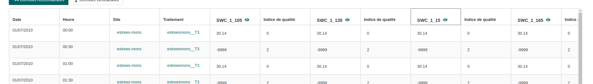

## Principe

Le principe de pattern component est de rechercher des colonnes répondant à un pattern (ecpression régulière).

-   s'il y a des groupes de capture dans l'expression régulière, il pourront être récupérés dans des ualifierComponents.
-   il est possible de définir des pattern pour rechercher des adjacentComponents. Ces pattern pourront se baser sur les expressions des groupes de captures (\$0, \$1 ...)
-   il va s'opérer une verticalisation de la ligne. C'est à dire q'une ligne sera créée pour chaque colonne répondant à un pattern component. La clef naturelle de la ligne + le groupe capturé (\$0) formeront la clef naturelle réelle de la ligne (naturalKey + patterncolumnname dans la base de données).

Du fait de la verticalisation, il est possible de placer des droits sur des composantes récupérée dans un patternComponent. Par exemple si l'on capture des colonnes "variables" dans un qualifierComponent 'variable' alors on pourra mettre des droits à la variable.

En sortie, il sera possible de choisir entre un affichage verticalisé (une colonne par ligne + qualifiers+adjacents) ou horizontalizé (toutes les colonnes dans une ligne)




## Exemple de déclaration de section OA_patternComponents:

::: {.callout-note title="OA_data" collapse="false"}
``` yaml
OA_data:
    t_swc_swc:
        OA_patternComponents:
            swc_value:
                OA_patternForComponents: "SWC(@?)_(.*)_(.*)"
                OA_required: false
                OA_exportHeader:
                    OA_title:
                        fr: "valeur"
                        en: "value"
                    OA_description:
                        fr: "valeur"
                        en: "value"
                OA_componentQualifiers:
                    - swc_variable:
                        OA_exportHeader:
                            OA_title:
                                fr: "Humidité volumique du sol"
                                en: "Soil water concentration"
                            OA_description:
                                fr: "variable mesurée"
                                en: "mesured variable"
                        OA_tags: [__ORDER_1__]
                        OA_defaultValue:
                            OA_expression: "'humidite_volumique_du_sol'"  #optional
                        OA_checker:
                            OA_name: OA_reference
                            OA_params:
                                OA_reference:
                                    OA_name: tr_variables_var
                    - swc_repetition:
                        OA_exportHeader:
                            OA_title:
                                fr: "répétition"
                                en: "repetition"
                            OA_description:
                                fr: "répétition de la variable"
                                en: "variable repetition"
                        OA_tags: [__ORDER_2__]
                        OA_checker:
                            OA_name: OA_integer
                    - swc_profondeur:
                        OA_exportHeader:
                            OA_title:
                                fr: "profondeur"
                                en: "depth"
                            OA_description:
                                fr: "profondeur de la mesure"
                                en: "depth of measurement"
                        OA_tags: [__ORDER_3__]
                        OA_checker:
                            OA_name: OA_float
                OA_componentAdjacents:
                - swc_quality_class:
                    OA_importHeaderPattern: "qc"
                    OA_tags: [__ORDER_4__]
                    OA_exportHeader: 
                        OA_title: 
                            fr: Indice de qualité
                            en: Quality class
                        OA_description: 
                            fr  correcte
                            en: 0 for valid value; 2 for invalid value
                    OA_required: false 
                    OA_mandatory: false 
                    OA_checker: 
                        OA_name: OA_integer 
                        OA_params: 
                            OA_max: 2 
                            OA_min: 0 
                            OA_multiplicity: ONE
```

## exemple
:::

### Définition du pattern

Pour des colonnes SWC_2_20 où 2 est la répétition de la mesure et 20 sa profondeur.

``` yaml
    OA_patternForComponents: "SWC(@?)_(.*)_(.*)"
```

On utilise une [expression regulière](https://docs.python.org/fr/3/howto/regex.html) pour rechercher dans l'en-tête du fichier des colonnes.

Les parenthèses correspondent à des groupes de capture. Ici (\@?) est toujours une chaîne vide ce qui nous permet d'utiliser une  pour définir une valeur de remplacement

``` yaml
    OA_defaultValue:
        OA_expression: "'humidite_volumique_du_sol'"
```

On aurait aussi pu utiliser

``` yaml
    OA_patternForComponents: "(humidite_volumique_du_sol)_(.*)_(.*)"
```

Mais cela aurait changé nos en-tête de colonne SWC_2_20 -\> humidite_volumique_du_sol_2_20

::: callout-important
```         

- Le parseur va rechercher toutes les colonnes . On recherche dans les colonnes restantes celles qui "matchent" un OA_patternForComponents.

- Le comportement final de OA_allowUnexpectedColumns dépendra de la valeur de OA_allowUnexpectedColumns.
```
:::

### définition de la colonne pattern.{#OA_patternForComponents}

Comme tous les composants vous allez pouvoir définir un type un utilisant un 


```yaml
OA_data:
    t_swc_swc:
        OA_patternComponents:
            swc_value:
                OA_patternForComponents: "SWC(@?)_(.*)_(.*)"
```
Dans cet exemple pour un fichier t_swc_swc.csv nous capturons toutes les colonnes répondant au pattern 
"SWC(@?)_(.*)_(.*)". ex: SWC_2_10. Les valeurs de la colonne capturée seront enregistrées dans la composante swc_value. Comme toute composante vous pourrez définir si la valeur est requise, définir un 
...

::: {.callout-note}
Le tag  est inutile puisque la définition ne cible pas une colonne mais des colonnes "matchantes"
:::

### Les qualifiants {#OA_componentQualifiers}

Il s'agit ici de constantes de colonne valables pour toutes les lignes. Les groupes de capture (les parenthèse de l'expression régulières) peuvent être enregistrées dans la section **OA_componentQualifiers**. Il s'agit d'un tableau de component qualifiers dont le premier élément correspond à la première capture, le deuxième à la deuxième et ainsi de suite.

```yaml
    OA_componentQualifiers:
        - swc_variable:
            OA_exportHeader:
                OA_title:
                    fr: "Humidité volumique du sol"
                    en: "Soil water concentration"
                OA_description:
                    fr: "variable mesurée"
                    en: "mesured variable"
            OA_tags: [__ORDER_1__]
            OA_defaultValue:
                OA_expression: "'humidite_volumique_du_sol'"  #optional
            OA_checker:
                OA_name: OA_reference
                OA_params:
                    OA_reference:
                        OA_name: tr_variables_var
        - swc_repetition:
            OA_exportHeader:
                OA_title:
                    fr: "répétition"
                    en: "repetition"
                OA_description:
                    fr: "répétition de la variable"
                    en: "variable repetition"
            OA_tags: [__ORDER_2__]
            OA_checker:
                OA_name: OA_integer
        - swc_profondeur:
            OA_exportHeader:
                OA_title:
                    fr: "profondeur"
                    en: "depth"
                OA_description:
                    fr: "profondeur de la mesure"
                    en: "depth of measurement"
            OA_tags: [__ORDER_3__]
            OA_checker:
                OA_name: OA_float
```

Dans notre cas le premier groupe n'ayant rien capturé, c'est la valeur par défaut qui est appliquée: 'humidite_volumique_du_sol' qui correspond à une clef étrangère "tr_variables_var". On enregistre cette valeur dans la composante "swc_variable" et on la lie à "tr_variables_var" en utilisant un  référence.

::: {.callout-warning title="colonnes calculées"}
Pour le moment il n'est pa possible d'utiliser des expressions calculées mais cette fonctionnalité est à venir. Dans ce cas on pourrait capturer le groupe 'SWC' et s'en servir pour trouver la ligne correspondante dans tr_variables_var. On aurait aussi pu avoir swc comme clef naturelle de cette ligne tr_variables_var.
:::

Le deuxième groupe capturé est la répétition (ici 2) enregistré dans la composante "swc_repetition". On utilise un  integer.

Le troisième groupe capturé est la profondeur (ici 20) enregistré dans la composante "v". On utilise un  float.

::: {.callout-tip title="clef naturelle"}

L'identifiant de la ligne est composé de la clef naturelle déclarée et de la valeur de l'en-tête de colonne (SWC_2_10).

:::

On peut définir les sections des composantes (, , , .)

### les colonnes adjacentes {#OA_componentAdjacents}

C'est une autre particularité des patterncComponents, celle de pouvoir regrouper des informations concernant une variable. Son écart-type, sa qualité, son unité... voir .

Une colonne adjacente s'entend comme colonne situé après la colonne de  et répondant à un **OA_importHeaderPattern**. Il peut y avoir un nombre indéfini de **OA_componentAdjacents** mais la recherche s'arrête dès qu'une colonne de répond pas à un **OA_importHeaderPattern**.

Les colonnes adjacentes sont définis dans la section **OA_componentAdjacents**.Il s'agit d'un tableau de composantes OA_componentAdjacent définis par un **OA_importHeaderPattern**. (expression régulière)

#### OA_importHeaderPattern {#OA_importHeaderPattern}
Chaque colonne adjacente est définie par une expression régulière. On peut réutiliser les résultat des groupes de capture de l'expression  en les mettant entre accolades.

::: {.callout-tip title="expressions de OA_importHeaderPattern"}
Si l'expression OA_patternForComponents est (.*) et qu'elle capture la colonne "co2" dans le groupe de capture 1 (première parenthèse), on pourra rechercher la colonne co2_et avec l'expression OA_importHeaderPattern; {$1}_et; la colonne co2_sd avec l'expression OA_importHeaderPattern; {$1}_sd et ainsi de suite.
:::


```yaml
OA_componentAdjacents:
    - dat_temperature_minimale:   
        OA_tags: [__ORDER_2__]
        OA_importHeaderPattern: "{$1} minimale"  
        OA_exportHeader:   
            OA_title:   
            fr: Température minimale
            en: Minimal temperature 
        OA_required: false  
        OA_mandatory: false  
        OA_checker:
            OA_name: OA_float
            OA_params:
            OA_min: -15.0
            OA_max: 45.0
    - dat_temperature_maximale:    
        OA_tags: [__ORDER_2__] 
        OA_importHeaderPattern: "{$1} maximale"  
        OA_exportHeader:   
            OA_title:   
            fr: Température maximale
            en: Maximal temperature 
        OA_required: false  
        OA_mandatory: false  
        OA_checker:
            OA_name: OA_float
            OA_params:
            OA_min: -15.0
            OA_max: 45.0
```

On peut définir les sections des composantes (, , , .)

### stockage en base de données
Les composantes d'une section **OA_patternComponents** sont enregistrées en base de données comme un objet json avec pour clef l' de cette composante.

Dans cet objet json la valeur capturée est enregistrée avec la clef **__VALUE__** et chaque composante qualifiante ou adjacente avec l' de sa composante.

On trouve aussi sous le label "__ORIGINAL_COLUMN_NAME__" le nom de la colonne originelle, et sous le label "__COLUMN_NAME__" l' de la composante patternComponents.

```postgresql
{
  "swc_value": {
    "__VALUE__": "32.04",
    "swc_variable": "humidite_volumique_du_sol",
    "swc_profondeur": 165,
    "swc_repetition": 1,
    "__COLUMN_NAME__": "swc_value",
    "swc_quality_class": 0,
    "__ORIGINAL_COLUMN_NAME__": "SWC_1_165"
  }
}
```
### expression groovy.

Si vous cherchez à récupérer une composante patternComponent, une composante qualifiante ou une composante adjacente, il faudra prendre en compte son stockage en base de donées:

::: {.callout-tip collapse="true" title="exemple de récupération des valeurs d'un pattern component"}
Avec la déclaration 
```yaml
OA_patternComponents:
      cpr_variable_value:
        OA_tags: [__ORDER_8__]
        OA_patternForComponents: "(.*)" # définition d'un pattern pour l'en-tête de colonne
        OA_required: false
        OA_exportHeader:
            OA_title:
              fr: "Valeur de la variable"
              en: "Value of variable"
            OA_description:
              fr: "Valeur de la variable"
              en: "variable value"
        OA_checker:
            OA_name: OA_float
        OA_componentQualifiers:
            - cpr_variable_nom: # on définit le nom qui ira à la place du 1er (.*)
                OA_exportHeader:
                    OA_title:
                        fr: "Nom de la variable"
                        en: "Variable name"
                OA_tags: [__ORDER_7__ ]
                OA_required: true
                OA_checker:
                    OA_name: OA_reference
                    OA_params:
                        OA_reference:
                            OA_name: tr_variable_var 
```
On va pouvoir effectuer une validation: 

Dans la ligne Object cpr_variable_value = datum.cpr_variable_value.__VALUE__; on récupère la valeur (__VALUE__) de la colonne capturée par la pattern composante cpr_variable_value

```yaml
OA_validations:
      controle_coherence_ctc: #mandatory
        OA_i18n:
          fr: vérification des valeurs
        OA_components: 
        - cpr_variable_value 
        OA_checker:
          OA_name: OA_groovyExpression
          OA_params:
            OA_groovy:
              OA_references:
                - tr_control_coherence_ctc
                - tr_valeurs_qualitatives_qal
              OA_expression: >
                    String datatype = "cpr";
                    String site = datum.cpr_site.toString().replace(" ", "_");
                    String variable = datum.cpr_variable_value.cpr_variable_nom.toString().replace(" ", "_");
                    Object cpr_variable_value = datum.cpr_variable_value.__VALUE__;
                    /* Vérification des valeurs vides*/
                    if (cpr_variable_value == "" || cpr_variable_value == "null") {
                        return true;
                    };
                    /* Recherche du contrôle de cohérence*/ def checker_coherence = references.tr_control_coherence_ctc.find {
                        it.naturalKey.equals(variable + '__' + datatype + '__' + site);
                    };
                    if (checker_coherence) {
                        /* Vérification des valeurs numériques*/
                        if (cpr_variable_value.isFloat() &&
                                checker_coherence.refValues["ctc_min_value"] &&
                                checker_coherence.refValues["ctc_max_value"]) {

                            Float value = Float.parseFloat(cpr_variable_value);
                            Float min = Optional.ofNullable(checker_coherence.refValues["ctc_min_value"])
                                    .map { it.toString() }
                                    .map { Float.parseFloat(it) }
                                    .orElse(null);
                            Float max = Optional.ofNullable(checker_coherence.refValues["ctc_max_value"])
                                    .map { it.toString() }
                                    .map { Float.parseFloat(it) }
                                    .orElse(null);

                            if (min <= value && value <= max) {
                                return true;
                            } else {
                                throw OA_buildException("NO_COHERENCE", Map.of(
                                        "datatype", datatype,
                                        "variable", variable,
                                        "site", site,
                                        "value", value,
                                        "min", min,
                                        "max", max
                                ));
                            };
                        } else {
                            return true;
                        };
                    } else if (cpr_variable_value != "null" &&
                            cpr_variable_value != "" &&
                            (references.tr_valeurs_qualitatives_qal.find {
                                it.naturalKey == (variable + '__' + Optional.ofNullable(cpr_variable_value)
                                        .map { val -> val.toString().replace(" ", "_") }
                                        .orElse(""));
                            })) {
                        return true;
                    } else {
                        throw OA_buildException("NO_QUALITATIVE_VALUE",
                                Map.of("value", cpr_variable_value.toString())
                        );
                    };

              OA_groovyExceptions:   #optional
                NO_QUALITATIVE_VALUE:
                   fr: "La valeur {value} n'est pas dans la liste des variables qualitatives définies dans le fichier de référence 10-Liste des valeurs qualitatives."
                   en: "The value {value} is not defined in the list of qualitatives variables in reference file 10-Qualitative values list"
                NO_COHERENCE:
                   fr: "Pour le type de données {datatype} et le site {site}: la valeur {value} de la variable {variable} doit être comprise entre {min} et {max}"
                   en: "For dataType  {datatype} and site  {site}: the value {value} for variable {variable} must be between {min} and  {max}"
```
:::
