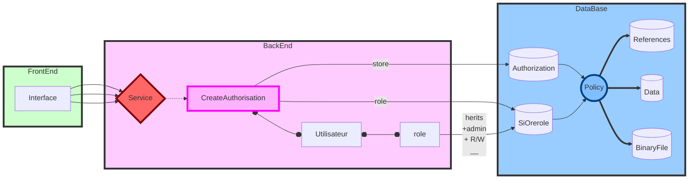

Les autorisations doivent évoluer et pour cela plusieurs travaux sont nécessaires.

## réécrire les authorizations actuelles afin de remplacer les boutons radios par des cases à cocher

- localizationscope pouvoir choisir plusieurs scope, ne garder que les noeuds de plus haut niveau (tous les enfants sélectionnés) et concaténer l'information dans une seule requête (par exemple VARIADIC ARRAY[where 'localization'::text]
  )::ltree ? array[E'theix.theix__11', E'laqueuille.*', E'estreesmons.estreesmons__a06']::lquery[]
  )
- datagroup choix 0, n datagroups (@>)
- choix de plusieurs timescopes
- mise en place d'index gist sur ces colonnes

## présentation des droits:

Les droits sont posés par types de données. Cependant on peut imaginer rajouter le type de données dans l'arborescence.  
En ce cas on créerait autant d'autorisations qu'il y a de type de données. 
A noter cependant que les localizationscopes peuvent différer d'un type de données à l'autre

- dérouler dans une treetable le ltree des localisationscope avec possibilité de dérouler un dernier niveau datagroup
  à chaque niveau **cases à cocher**. avec possibilité de fixer une période.

| localisationscope | admin | dépôt | publication | extraction | date de début | date de fin |
| ------ | ------ | ------ | ------ | ------ |------ | ------ |
| monprojet |:white_medium_square: | :white_medium_square: | :white_medium_square: | :white_check_mark:  | &nbsp; | &nbsp; | 
&nbsp;&nbsp;&nbsp;└───monsite |:white_medium_square: | :white_medium_square: | :white_check_mark: | :white_check_mark:  |
&nbsp;&nbsp;&nbsp;&nbsp;&nbsp;&nbsp;&nbsp;└───maparcelle |:white_check_mark: | :white_medium_square: | :white_check_mark: | :white_check_mark:  | &nbsp; | &nbsp; |

La requête correspondante contiendrait des _or_. Chaque ligne étant un cas _where_ (utilisation éventuelle des @>). On ne garde que les premiers noeuds ayant une case cochées; les noeuds enfants (y compris ceux à venir) sont cochés.

- Choisir une combinaison de localisationscopes, datagroups et timeranges pour une requête du type where [localisationscopes] @> ... and [datagroups] @>... and [timerange] @>... C'est ce qui est actuellement présenté (mais avec des cases à cocher vs boutons radio)

## web service et base de données:

Il est possible qu'une configuration d'interface (une case cachée) soit enregistrée dans plusieurs tables et correspondre à plusieurs policies.
- admin : délégation de droits.
    - Tout d'abord possibilité de déléguer un rôle en ajoutant un utilisateur dans un groupe que l'on possède. A priori, la clause admin de create role permet cette délégation de rôle. (Ce qui éviterait d'avoir un privilège createrole potentiellement faille de sécurité). On pourrait créer un nouveau rôle contenant tous les rôles de l'utilisateur avec la clause admin.
    - ensuite la possibilité de créer une nouvelle autorisation qui est forcément une sous partie des rôle que l'on a. Logiciellement ce n'est peut-être pas compliqué mais qu'en est-il de cette possibilité sur la base de données. Peut-être un check
      à l'enregistrement du rôle qui vérifie que la nouvelle autorisation est inclusive d'une autorisation existante pour l'utilisateur. On peut aussi se contenter de limiter admin à la délégation d'une autorisation existente et limiter la création d'autorisations aux seules administrateurs de l'application.

- dépôt il s'agit du droit de déposer un fichier(table binaryfile) en ajoutant une policy sur cette table.
- publication il s'agit d'une policy sur la table data en ecriture
- extraction : il s'agit d'une policy sur la table data en lecture
- dates de début et de fin actuellement que pour la lecture, mais on pourrait rajouter cela pour le dépôt (il s'agit là de l'interval de date des données) ou pour l'administration (période de validité du droit)

## données de référence

Dans la v1 pas de découpage fin de la données de référence. Cependant on pourrait s'appuyer soit sur les clés hiérarchique soit sur les références pour limiter la création d'une données de référence à un domaine (une policy en lecture ou écriture sur la table référence qui vérifie que la ligne insérée ou lue respecte bien un certain pattern)

